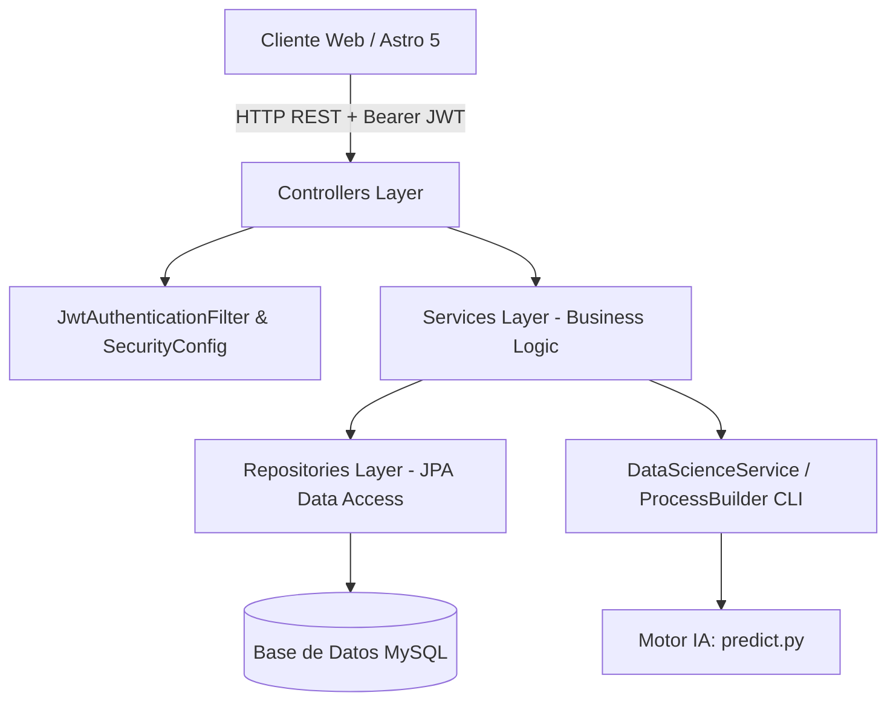
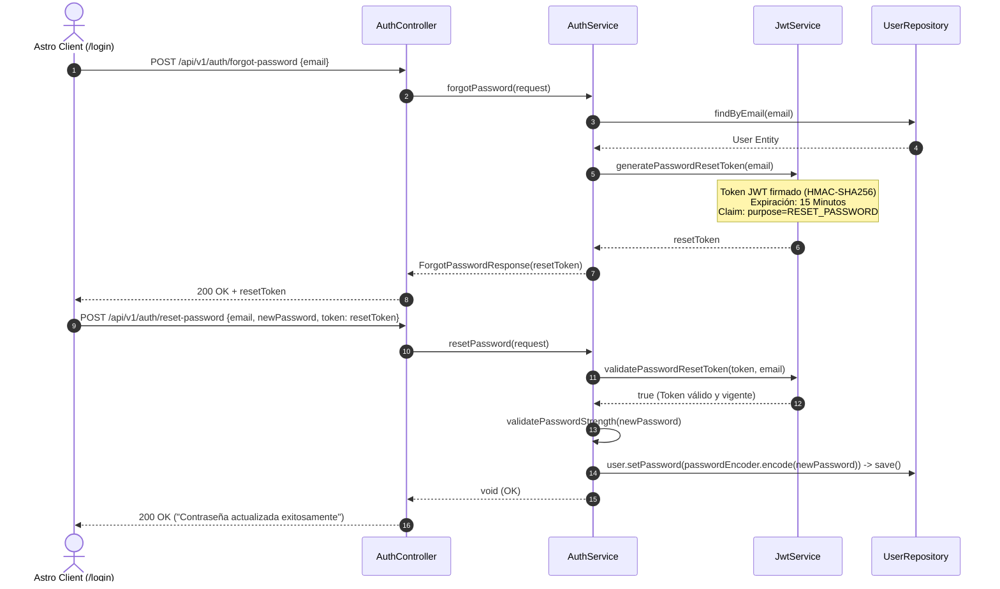
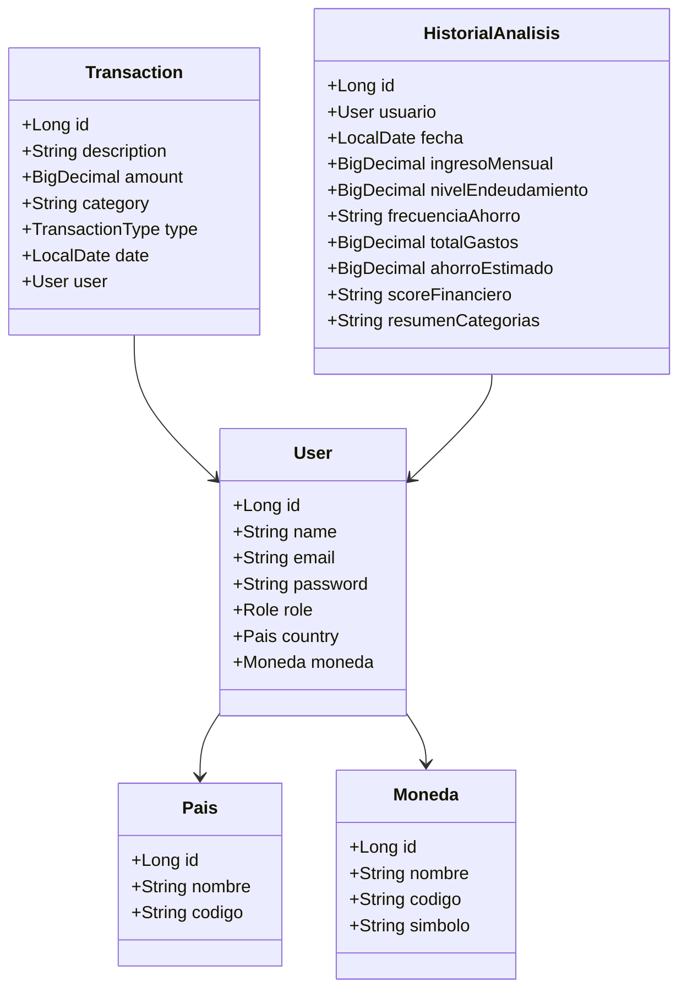

# Documentación Técnica del Backend — FinanceAI

Documentación técnica integral de la capa de servicios, arquitectura de persistencia, políticas de seguridad criptográfica y catálogo de endpoints del servidor desarrollado con **Spring Boot 3** y **Java 17 LTS**.

---

## 1. Entorno Oficial de Compilación y Ejecución

- **Lenguaje / JDK:** **Java 17 LTS** (OpenJDK 17 / Microsoft Build of OpenJDK `ms-17.0.20.1`).
- **Framework:** **Spring Boot 3** (Spring Framework 6, Spring Security 6, Spring Data JPA, Hibernate 6).
- **Gestor de Dependencias y Compilación:** **Apache Maven 3.8+** (con soporte de wrapper `./mvnw` y `mvnw.cmd`).
- **Base de Datos:** **MySQL 8.0** (Instancia gestionada en Railway / compatible con MySQL Local).
- **Entorno de Inteligencia Artificial:** **Python 3.10+** (Scikit-Learn, Pandas, NumPy) orquestado vía `ProcessBuilder`.

---

## 2. Arquitectura de Configuración Centralizada (.env)

El backend se adhiere a la arquitectura de **archivo `.env` único centralizado en la raíz del proyecto (`C:\Java\G9-LATAM-Team-77\.env`)**.

En `src/main/resources/application.properties`, se configura:
```properties
spring.application.name=financeia-backend

# Importación directa del archivo .env centralizado en la raíz del repositorio
spring.config.import=optional:file:../../.env

# Configuración de Base de Datos MySQL (Railway)
spring.datasource.url=jdbc:mysql://sakura.proxy.rlwy.net:32819/railway
spring.datasource.username=${MYSQLUSER}
spring.datasource.password=${MYSQL_ROOT_PASSWORD}
spring.datasource.driver-class-name=com.mysql.cj.jdbc.Driver
spring.jpa.database-platform=org.hibernate.dialect.MySQLDialect

# Clave secreta JWT leída desde la raíz .env
jwt.secret=${JWT_SECRET}

# Integración Backend -> Data Science Subprocess
financeai.python.command=${PYTHON_COMMAND:../../DataScient/venv/Scripts/python.exe}
financeai.data-science.script=${DATA_SCIENCE_SCRIPT:../../DataScient/src/predict.py}
```

Esta arquitectura garantiza que las credenciales de base de datos, secretos criptográficos y rutas de ejecución se compartan de manera limpia entre Frontend y Backend sin duplicidad ni riesgo de desincronización.

---

## 3. Arquitectura General del Sistema



---

## 4. Política de Alta Seguridad en Contraseñas (Backend)

La seguridad y entropía de las credenciales se valida a nivel de servicio mediante el método estático centralizado `AuthService.validatePasswordStrength(password)`:

```java
public static void validatePasswordStrength(String password) {
    if (password == null || password.length() < 8) {
        throw new RuntimeException("La contraseña debe tener un mínimo de 8 caracteres.");
    }
    boolean hasUpper = password.chars().anyMatch(Character::isUpperCase);
    boolean hasLower = password.chars().anyMatch(Character::isLowerCase);
    boolean hasDigit = password.chars().anyMatch(Character::isDigit);
    boolean hasSpecial = password.chars().anyMatch(ch -> "!@#$%^&*()_+-=[]{};':\"|,.<>/?~`\\".indexOf(ch) >= 0);

    if (!hasUpper) {
        throw new RuntimeException("La contraseña debe incluir al menos una letra mayúscula.");
    }
    if (!hasLower) {
        throw new RuntimeException("La contraseña debe incluir al menos una letra minúscula.");
    }
    if (!hasDigit) {
        throw new RuntimeException("La contraseña debe incluir al menos un número.");
    }
    if (!hasSpecial) {
        throw new RuntimeException("La contraseña debe incluir al menos un carácter especial (!@#$%^&*...).");
    }
}
```

### Las 5 Reglas de Validación en Servidor:
1. **Longitud Mínima:** Al menos 8 caracteres.
2. **Mayúsculas:** Al menos una letra mayúscula (`Character::isUpperCase`).
3. **Minúsculas:** Al menos una letra minúscula (`Character::isLowerCase`).
4. **Números:** Al menos un dígito (`Character::isDigit`).
5. **Caracteres Especiales:** Al menos un símbolo del conjunto `!@#$%^&*()_+-=[]{};':"|,.<>/?~`\`.

Este validador es ejecutado obligatoriamente tanto en el registro de nuevos usuarios (`POST /api/v1/auth/register`) como en el restablecimiento de contraseñas (`POST /api/v1/auth/reset-password`). Toda violación arroja una excepción manejada por el `GlobalExceptionHandler` retornando un código `400 Bad Request`.

---

## 5. Flujo Criptográfico de Recuperación de Contraseñas (Tokens Temporales)

El backend implementa un mecanismo seguro basado en tokens JWT temporales con firma HMAC-SHA256 y propósito específico:



### Endpoints Involucrados:
- **`POST /api/v1/auth/forgot-password`:** Recibe `{ "email": "..." }`. Valida existencia del usuario y genera un token temporal de **15 minutos** con claim `purpose: RESET_PASSWORD`.
- **`POST /api/v1/auth/reset-password`:** Recibe `{ "email": "...", "newPassword": "...", "token": "..." }`. Valida criptográficamente el token y su vigencia, verifica las 5 reglas de complejidad y persiste el nuevo hash BCrypt.

---

## 6. Diagrama de Clases y Entidades JPA



---

## 7. Diccionario de Datos (Esquema de Base de Datos)

### Tabla: `paises`
| Columna | Tipo | Restricciones | Descripción |
|---|---|---|---|
| `id` | BIGINT | PRIMARY KEY, AUTO_INCREMENT | Identificador único del país. |
| `nombre` | VARCHAR | NOT NULL | Nombre del país (ej. México, Colombia). |
| `codigo` | VARCHAR | NOT NULL, UNIQUE | Código ISO del país (ej. MX, CO, US). |

### Tabla: `monedas`
| Columna | Tipo | Restricciones | Descripción |
|---|---|---|---|
| `id` | BIGINT | PRIMARY KEY, AUTO_INCREMENT | Identificador único de la divisa. |
| `nombre` | VARCHAR | NOT NULL | Nombre de la moneda. |
| `codigo` | VARCHAR | NOT NULL, UNIQUE | Código ISO de la moneda (`USD`, `MXN`, `EUR`, `CRC`, `COP`, `ARS`, `CLP`, `PEN`). |
| `simbolo` | VARCHAR | NOT NULL | Símbolo oficial (`$`, `€`, `₡`, `S/`). |

### Tabla: `usuarios`
| Columna | Tipo | Restricciones | Descripción |
|---|---|---|---|
| `id` | BIGINT | PRIMARY KEY, AUTO_INCREMENT | Identificador único del usuario. |
| `name` | VARCHAR | NOT NULL | Nombre completo del usuario. |
| `email` | VARCHAR | NOT NULL, UNIQUE | Correo electrónico institucional / personal. |
| `password` | VARCHAR | NOT NULL | Contraseña encriptada con hash BCrypt. |
| `pais_id` | BIGINT | FOREIGN KEY | Referencia a `paises(id)`. |
| `moneda_id` | BIGINT | FOREIGN KEY | Referencia a `monedas(id)`. |
| `role` | VARCHAR | NOT NULL | Rol de autorización (`USER`, `ADMIN`). |

### Tabla: `transacciones`
| Columna | Tipo | Restricciones | Descripción |
|---|---|---|---|
| `id` | BIGINT | PRIMARY KEY, AUTO_INCREMENT | Identificador único del movimiento. |
| `description` | VARCHAR | NOT NULL | Concepto / descripción de la transacción. |
| `amount` | DECIMAL(15,2) | NOT NULL | Monto financiero en moneda base. |
| `category` | VARCHAR | NOT NULL | Categoría financiera normalizada. |
| `type` | VARCHAR | NOT NULL | Tipo de flujo: `INCOME` o `EXPENSE`. |
| `date` | DATE | NOT NULL | Fecha de realización de la transacción. |
| `usuario_id` | BIGINT | FOREIGN KEY, NOT NULL | Referencia a `usuarios(id)` con eliminación en cascada. |

### Tabla: `historial_analisis`
| Columna | Tipo | Restricciones | Descripción |
|---|---|---|---|
| `id` | BIGINT | PRIMARY KEY, AUTO_INCREMENT | Identificador único del registro de análisis. |
| `usuario_id` | BIGINT | FOREIGN KEY, NOT NULL | Referencia al usuario evaluado. |
| `fecha` | DATE | NOT NULL | Fecha de ejecución del análisis con IA. |
| `ingreso_mensual` | DECIMAL(15,2) | NOT NULL | Ingreso mensual evaluado. |
| `nivel_endeudamiento` | DECIMAL(15,2) | NOT NULL | Ratio de deuda mensual sobre ingresos. |
| `frecuencia_ahorro` | VARCHAR(255) | | Frecuencia descriptiva del ahorro. |
| `total_gastos` | DECIMAL(15,2) | NOT NULL | Gastos totales acumulados del periodo. |
| `ahorro_estimado` | DECIMAL(15,2) | | Capacidad neta estimada de ahorro. |
| `score_financiero` | VARCHAR(255) | NOT NULL | Puntuación obtenida (0 a 100). |
| `resumen_categorias` | TEXT | | Desglose JSON de categorías evaluadas. |

---

## 8. Catálogo Completo de Endpoints REST

Existen exactamente 13 endpoints operativos en el backend agrupados por controlador:

### 8.1 Autenticación y Cuentas (`AuthController`)
| Método | Endpoint | Acceso | Request Payload | Códigos de Respuesta | Descripción |
|---|---|---|---|---|---|
| `POST` | `/api/v1/auth/register` | Pública | `RegistroRequest` | `201 Created`, `400 Bad Request` | Registro con validación de 5 reglas de contraseña. |
| `POST` | `/api/v1/auth/login` | Pública | `LoginRequest` | `200 OK` (JWT), `401 Unauthorized` | Autenticación con email y contraseña. |
| `POST` | `/api/v1/auth/google-sync` | Pública | `GoogleSyncRequest` | `200 OK` (JWT) | Sincronización de credenciales OAuth2 de Google. |
| `POST` | `/api/v1/auth/forgot-password` | Pública | `ForgotPasswordRequest` | `200 OK` (Token 15 min), `404 Not Found` | Generación de token temporal de recuperación. |
| `POST` | `/api/v1/auth/reset-password` | Pública | `ResetPasswordRequest` | `200 OK`, `400 Bad Request` | Restablecimiento con token temporal y validación de clave. |

### 8.2 Perfil y Gestión de Usuarios (`UserController`)
| Método | Endpoint | Acceso | Request Payload | Códigos de Respuesta | Descripción |
|---|---|---|---|---|---|
| `GET` | `/api/v1/users/profile` | `Bearer JWT` | Ninguno | `200 OK` | Consulta de datos del perfil autenticado. |
| `PUT` | `/api/v1/users/profile` | `Bearer JWT` | `UserUpdateRequest` | `200 OK` | Actualización de moneda base y país. |
| `DELETE` | `/api/v1/users/profile` | `Bearer JWT` | Ninguno | `204 No Content` | Eliminación atómica en cascada de la cuenta y sus datos. |

### 8.3 Transacciones Financieras (`TransactionController`)
| Método | Endpoint | Acceso | Request Payload | Códigos de Respuesta | Descripción |
|---|---|---|---|---|---|
| `GET` | `/api/v1/transactions` | `Bearer JWT` | Query params opcionales | `200 OK` | Lista acumulada de transacciones del usuario. |
| `POST` | `/api/v1/transactions` | `Bearer JWT` | `TransactionRequest` | `201 Created` | Creación y persistencia de una nueva transacción. |

### 8.4 Tablero Analítico (`DashboardController`)
| Método | Endpoint | Acceso | Request Payload | Códigos de Respuesta | Descripción |
|---|---|---|---|---|---|
| `GET` | `/api/v1/dashboard/summary` | `Bearer JWT` | Ninguno | `200 OK` | Resumen de KPIs de ingresos, gastos y balance. |
| `GET` | `/api/v1/dashboard/history` | `Bearer JWT` | Ninguno | `200 OK` | Series temporales agregadas para visualización gráfica. |

### 8.5 Análisis con Inteligencia Artificial (`AnalisisController`)
| Método | Endpoint | Acceso | Request Payload | Códigos de Respuesta | Descripción |
|---|---|---|---|---|---|
| `POST` | `/api/v1/analisis-financiero`<br/>*(alias: `/analisis-financiero`)* | Pública / `Bearer JWT` | `AnalisisRequest` (JSON) | `200 OK` | Diagnóstico de salud financiera, clasificación automática de gastos y recomendaciones objetivas con IA. |

#### Casos de Uso de Prueba (Postman):

**🟢 Opción A: Modo Automático Simplificado (Recomendado para Frontend & Apps)**
*Solo envía ingresos y transacciones reales; la IA calcula endeudamiento, ahorro y clasifica los gastos.*
```json
// Request POST /api/v1/analisis-financiero
{
  "ingreso_mensual": 4500,
  "transacciones": [
    { "descripcion": "Supermercado", "valor": 420 },
    { "descripcion": "Combustible", "valor": 300 },
    { "descripcion": "Streaming", "valor": 40 }
  ]
}
```

```json
// Response 200 OK
{
  "status": "success",
  "score_financiero": 83,
  "perfil_financiero": "Saludable",
  "probabilidad": 0.92,
  "ingreso_mensual": 4500.0,
  "total_gastos": 760.0,
  "ahorro_estimado": 3740.0,
  "nivel_endeudamiento": 0.0,
  "frecuencia_ahorro": "Alta",
  "periodicidad": "mensual",
  "moneda": "USD",
  "resumen_gastos": {
    "Alimentación": 420.0,
    "Transporte": 300.0,
    "Entretenimiento": 40.0
  },
  "transacciones_categorizadas": [
    { "descripcion": "Supermercado", "valor": 420.0, "categoria": "Alimentación" },
    { "descripcion": "Combustible", "valor": 300.0, "categoria": "Transporte" },
    { "descripcion": "Streaming", "valor": 40.0, "categoria": "Entretenimiento" }
  ],
  "recomendaciones": [
    "Tu salud financiera está en nivel Saludable (83/100). Tus finanzas muestran un equilibrio óptimo entre ingresos, gastos operativos y capacidad de ahorro.",
    "Factor determinante: tu relación Gasto/Ingreso — estás destinando el 17% de tu ingreso a gastos corrientes, manteniendo un margen amplio de liquidez.",
    "Mantén tu disciplina de presupuesto y destina al menos 5% adicional de tus excedentes a instrumentos de inversión o fondos de liquidez."
  ]
}
```

**🔵 Opción B: Modo Explícito con Parámetros Precalculados (Para Simulaciones e Integraciones Externas)**
*Envía métricas crediticias preestablecidas (`nivel_endeudamiento` y `frecuencia_ahorro`).*
```json
// Request POST /api/v1/analisis-financiero
{
  "ingreso_mensual": 4500,
  "nivel_endeudamiento": 25,
  "frecuencia_ahorro": "Media",
  "transacciones": [
    { "descripcion": "Supermercado", "valor": 420 },
    { "descripcion": "Combustible", "valor": 300 },
    { "descripcion": "Streaming", "valor": 40 }
  ]
}
```

```json
// Response 200 OK
{
  "status": "success",
  "score_financiero": 83,
  "perfil_financiero": "Saludable",
  "probabilidad": 0.92,
  "ingreso_mensual": 4500.0,
  "total_gastos": 760.0,
  "ahorro_estimado": 3740.0,
  "nivel_endeudamiento": 25.0,
  "frecuencia_ahorro": "Alta",
  "periodicidad": "mensual",
  "moneda": "USD",
  "resumen_gastos": {
    "Alimentación": 420.0,
    "Transporte": 300.0,
    "Entretenimiento": 40.0
  },
  "transacciones_categorizadas": [
    { "descripcion": "Supermercado", "valor": 420.0, "categoria": "Alimentación" },
    { "descripcion": "Combustible", "valor": 300.0, "categoria": "Transporte" },
    { "descripcion": "Streaming", "valor": 40.0, "categoria": "Entretenimiento" }
  ],
  "recomendaciones": [
    "Tu salud financiera está en nivel Saludable (83/100). Tus finanzas muestran un equilibrio óptimo entre ingresos, gastos operativos y capacidad de ahorro.",
    "Factor determinante: tu nivel de endeudamiento — el 25% de tus ingresos está comprometido en obligaciones fijas o pasivos.",
    "Considera amortizaciones anticipadas a capital en créditos de tasa variable para blindar tu patrimonio."
  ]
}
```

#### Catálogo de Frecuencias y Delimitación de Parámetros:
- **`frecuencia_ahorro`:**
  - *Alta:* `"Alta"`, `"Diaria"`, `"Semanal"`, `"Frecuente"`, `"Constante"` (33 pts).
  - *Media:* `"Media"`, `"Quincenal"`, `"Mensual"`, `"Regular"` (16 pts).
  - *Baja:* `"Baja"`, `"Ocasional"`, `"Anual"`, `"Nunca"`, `"Ninguna"` (0 pts).
  - *Auto / Desconocido:* Calculada dinámicamente según ratio de ahorro real.
- **`nivel_endeudamiento` ($0\%$ a $100\%$):**
  - Si es $< 0\%$ (ej. $-25\%$): Normalizado a `0.0%`.
  - Si es $> 100\%$ (ej. $150\%$, $500\%$): Clampeado a `100.0%` con alerta de sobreendeudamiento crítico.
- **Manejo de Errores (`HTTP 400 Bad Request`):**
  - Letras en campos numéricos (ej. `"ingreso_mensual": "mil"`): Error deserialización Jackson.
  - Símbolos en valores (ej. `"valor": "$500"`): Error de tipo numérico.
  - Números negativos en ingresos (ej. `-1500`): Error Bean Validation `@PositiveOrZero`.
  - JSON malformado o con errores sintácticos.

### 8.6 Monitoreo y Disponibilidad (`HealthController`)
| Método | Endpoint | Acceso | Request Payload | Códigos de Respuesta | Descripción |
|---|---|---|---|---|---|
| `GET` | `/api/v1/health` | Pública | Ninguno | `200 OK` (`{"status":"UP"}`) | Liveness and readiness health check. |

---

## 9. Guía de Compilación y Ejecución del Backend

### Comandos de Compilación (Maven)
```bash
cd Backend/financeia-backend

# 1. Compilación limpia omitiendo pruebas
./mvnw clean install -DskipTests

# 2. Ejecutar servidor Spring Boot en puerto 8080
./mvnw spring-boot:run
```

- **Endpoint de Verificación:** `http://localhost:8080/api/v1/health`
- **Interfaz Swagger UI:** `http://localhost:8080/swagger-ui.html`

---

## 10. Cumplimiento Legal y Privacidad en el Backend

### 10.1 Soporte Técnico para Derechos ARCO (LFPDPPP & GDPR)
1. **Derecho de Acceso (Portabilidad):**
   - El endpoint `GET /api/v1/transactions` y `GET /api/v1/users/profile` proporcionan la totalidad de los datos estructurados del titular en formato JSON estándar.
2. **Derecho de Rectificación:**
   - El endpoint `PUT /api/v1/users/profile` permite modificar en tiempo real la divisa preferida (`monedaId`) y país del titular.
3. **Derecho de Cancelación / Supresión ("Derecho al Olvido"):**
   - El endpoint `DELETE /api/v1/users/profile` ejecuta una transacción `@Transactional` con purga atómica e irreversible en la base de datos MySQL, eliminando todas las transacciones, históricos de análisis y el registro del usuario con integridad referencial.

### 10.2 Integración Segura de Google OAuth 2.0
- El endpoint `POST /api/v1/auth/google-sync` valida los tokens emitidos por Google y crea o sincroniza la cuenta sin almacenar tokens de acceso externos invasivos.
- Se cumple con la **Política de Datos de Usuario de los Servicios de la API de Google** y sus requisitos de Uso Limitado.

