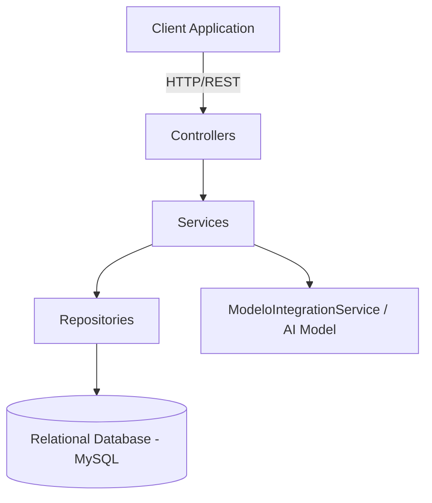
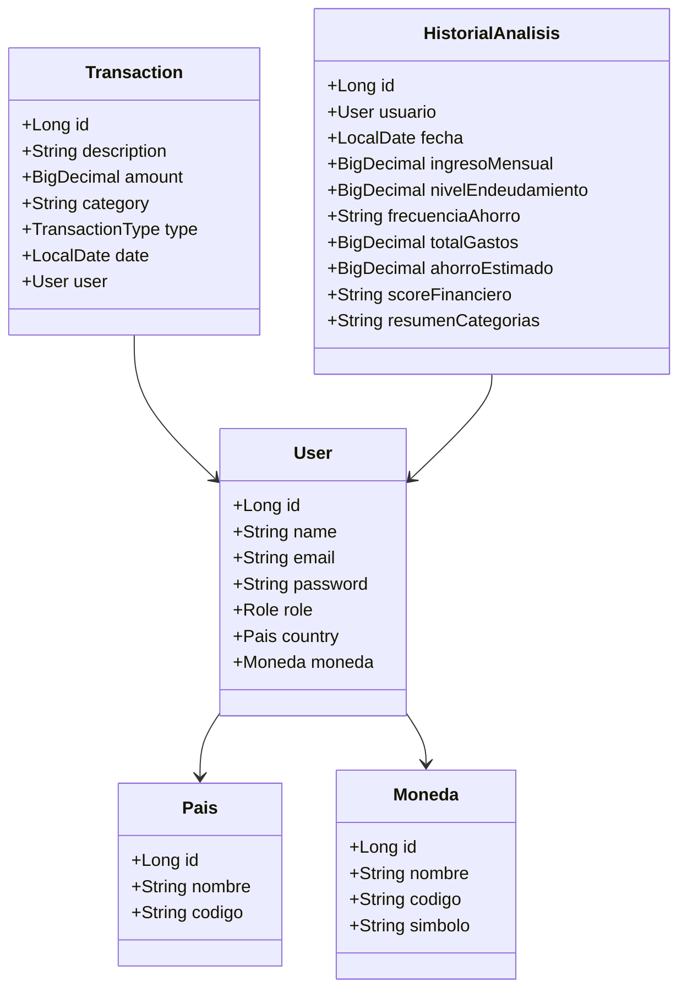

# FinanceAI Backend Documentation

## 1. Architecture Overview

## 2. Class Diagram

## 3. Database Schema (Data Dictionary)
The database follows a relational model. Below is the detailed schema representation.

### Table: paises
| Column | Type | Constraints | Description |
|---|---|---|---|
| id | BIGINT | PRIMARY KEY, AUTO_INCREMENT | Unique identifier for the country. |
| nombre | VARCHAR | NOT NULL | Name of the country. |
| codigo | VARCHAR | NOT NULL | ISO country code. |

### Table: monedas
| Column | Type | Constraints | Description |
|---|---|---|---|
| id | BIGINT | PRIMARY KEY, AUTO_INCREMENT | Unique identifier for the currency. |
| nombre | VARCHAR | NOT NULL | Name of the currency. |
| codigo | VARCHAR | NOT NULL | ISO currency code. |
| simbolo | VARCHAR | NOT NULL | Symbol of the currency. |

### Table: usuarios
| Column | Type | Constraints | Description |
|---|---|---|---|
| id | BIGINT | PRIMARY KEY, AUTO_INCREMENT | Unique identifier for the user. |
| name | VARCHAR | NOT NULL | Full name of the user. |
| email | VARCHAR | NOT NULL, UNIQUE | User email address. |
| password | VARCHAR | NOT NULL | Encrypted user password. |
| pais_id | BIGINT | FOREIGN KEY | Reference to paises(id). |
| moneda_id | BIGINT | FOREIGN KEY | Reference to monedas(id). |
| role | VARCHAR | NOT NULL | User authorization role. |

### Table: transacciones
| Column | Type | Constraints | Description |
|---|---|---|---|
| id | BIGINT | PRIMARY KEY, AUTO_INCREMENT | Unique transaction identifier. |
| description | VARCHAR | NOT NULL | Brief description of the transaction. |
| amount | DECIMAL(15,2) | NOT NULL | Financial amount. |
| category | VARCHAR | NOT NULL | Category classification. |
| type | VARCHAR | NOT NULL | Enum: INCOME or EXPENSE. |
| date | DATE | NOT NULL | Date of the transaction. |
| usuario_id | BIGINT | FOREIGN KEY, NOT NULL | Reference to usuarios(id). |

### Table: historial_analisis
| Column | Type | Constraints | Description |
|---|---|---|---|
| id | BIGINT | PRIMARY KEY, AUTO_INCREMENT | Unique analysis identifier. |
| usuario_id | BIGINT | FOREIGN KEY, NOT NULL | Reference to usuarios(id). |
| fecha | DATE | NOT NULL | Date the analysis was executed. |
| ingreso_mensual | DECIMAL(15,2) | | Total monthly income. |
| nivel_endeudamiento | DECIMAL(15,2) | | User debt ratio. |
| frecuencia_ahorro | VARCHAR(255) | | Saving frequency descriptive string. |
| total_gastos | DECIMAL(15,2) | | Total monthly expenses. |
| ahorro_estimado | DECIMAL(15,2) | | Estimated possible savings. |
| score_financiero | VARCHAR(255) | | Computed financial score. |
| resumen_categorias | TEXT | | Breakdown of categories. |

## 4. REST Endpoints Matrix

There are exactly 13 endpoints available in the system.

### Analysis Endpoints (AnalisisController)
| Method | Endpoint | Description | Request Payload | Response Payload |
|---|---|---|---|---|
| POST | `/api/v1/analisis-financiero` | Standard financial analysis | `Map<String, Object>` | `Map<String, Object>` |
| POST | `/api/v1/analisis-financiero/retrain` | Retrain AI model | N/A | `Map<String, String>` |
| POST | `/api/v1/analisis-financiero/ia` | Execute specific AI routines | `Map<String, Object>` | `Map<String, Object>` |
| POST | `/api/v1/analisis-financiero/clasificar` | Classify transactions via AI | `Map<String, Object>` | `Map<String, String>` |

### Authentication Endpoints (AuthController)
| Method | Endpoint | Description | Request Payload | Response Payload |
|---|---|---|---|---|
| POST | `/api/v1/auth/register` | Register new user account | `RegistroRequest` | `RegistroResponse` |
| POST | `/api/v1/auth/login` | Authenticate user | `LoginRequest` | `LoginResponse` |

### Dashboard Endpoints (DashboardController)
| Method | Endpoint | Description | Request Payload | Response Payload |
|---|---|---|---|---|
| GET | `/api/v1/dashboard/summary` | Get summarized dashboard data | N/A | `DashboardResponse` |
| GET | `/api/v1/dashboard/history` | Get historical dashboard data | N/A | `List<DashboardResponse>` |

### Health Endpoints (HealthController)
| Method | Endpoint | Description | Request Payload | Response Payload |
|---|---|---|---|---|
| GET | `/api/v1/health` | Service health check | N/A | `HealthResponse` |

### Transaction Endpoints (TransactionController)
| Method | Endpoint | Description | Request Payload | Response Payload |
|---|---|---|---|---|
| POST | `/api/v1/transactions` | Create a new transaction | `TransactionRequest` | `TransactionResponse` |
| GET | `/api/v1/transactions` | Retrieve user transactions | N/A | `List<TransactionResponse>` |

### User Endpoints (UserController)
| Method | Endpoint | Description | Request Payload | Response Payload |
|---|---|---|---|---|
| GET | `/api/v1/users/profile` | Retrieve user profile | N/A | `UserResponse` |
| PUT | `/api/v1/users/profile` | Update user profile | `UserUpdateRequest` | `UserResponse` |
