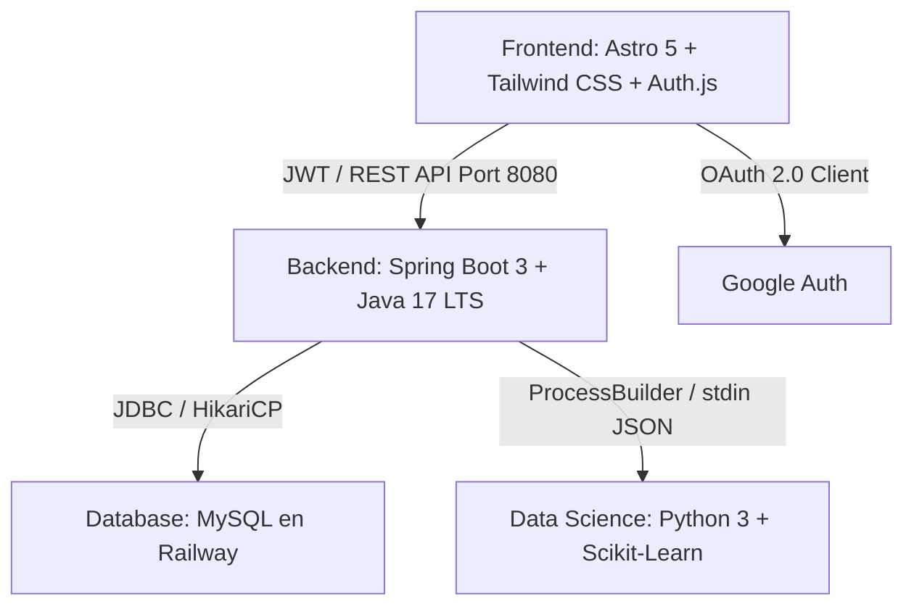
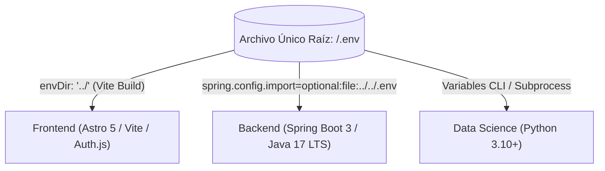

# Manual y Documentación Técnica Integral de FinanceAI

**Proyecto:** FinanceAI — Asistente Inteligente de Salud Financiera  
**Equipo:** No Country Simulation / G9-LATAM-Team-77  
**Entorno Oficial de Compilación:** Java 17 LTS (OpenJDK 17 / Microsoft Build ms-17.0.20.1) & Spring Boot 3  
**Fecha de Actualización:** 2026-08-21  

---

## 1. Arquitectura General y Configuración Centralizada

FinanceAI es una plataforma empresarial orientada a la evaluación, diagnóstico y proyección de la salud financiera en Latinoamérica. Su arquitectura está desacoplada en tres capas autónomas interconectadas mediante contratos REST, tokens criptográficos JWT y subprocesos CLI:



### 1.1 Arquitectura de Único Archivo `.env` Centralizado

Para garantizar portabilidad, seguridad y evitar divergencias de configuración, el proyecto implementa un **único archivo `.env` centralizado en la raíz del repositorio (`C:\Java\G9-LATAM-Team-77\.env`)**:



- **Frontend (Astro / Vite):** Configurado en `Frontend/astro.config.mjs` con `vite: { envDir: '../' }`, leyendo directamente tanto variables públicas (`PUBLIC_API_URL`, `SITE_URL`) como privadas (`AUTH_SECRET`, `GOOGLE_CLIENT_ID`, `GMAIL_PASS`).
- **Backend (Spring Boot 3):** Configurado en `Backend/financeia-backend/src/main/resources/application.properties` con `spring.config.import=optional:file:../../.env`, mapeando sin redundancias `${MYSQLUSER}`, `${MYSQL_ROOT_PASSWORD}`, `${JWT_SECRET}`, `${CORS_ALLOWED_ORIGINS}` y rutas de ejecución Python.

---

## 2. Especificación Detallada de Módulos

### 2.1 Frontend (`Frontend/`)
- **Framework & Motor:** Astro 5 (Server Output con Standalone Node Adapter) + TypeScript + Tailwind CSS.
- **Tipografía Oficial:** `Josefin Sans` (geométrica, elegante y moderna) para títulos, logotipos y badges; `Inter` para formularios, tablas numéricas y métricas analíticas.
- **Motor Multidivisa en Tiempo Real (`Frontend/src/lib/currency.ts`):**
  - Soporte integral para las 8 divisas oficiales: `USD`, `MXN`, `EUR`, `CRC`, `COP`, `ARS`, `CLP`, `PEN`.
  - Matriz de paridad base USD con actualización diaria en caché (`localStorage` 24h) y respaldo heurístico (*fallback*).
  - Ticker de cotización interactivo en el `Header` en vivo.
  - Barra reactiva de selección de divisa en `/historial` para recalcular en caliente KPIs, gráficas y tablas sin mutar los datos en base de datos.
  - Restauración automática de la divisa base configurada en el perfil del usuario al refrescar (`F5`).
- **Calendario Personalizado Glassmorphism:**
  - Componente translúcido adaptativo para **Modo Claro y Modo Oscuro**.
  - Matriz de 12 baldosas, navegador de años (`< 2026 >`) y restricción de negocio: máximo 2 años atrás (24 meses) hasta la fecha actual del sistema.
- **Sistema de Cierre de Sesión (Logout UX):**
  - Modal centrado superpuesto con desenfoque de fondo profundo (`backdrop-blur-xl`).
  - Aislamiento visual total (ocultamiento de navegación superior y avatar) para focalizar la acción del usuario.
- **Servicio de Notificaciones por Correo:** Integración con **Nodemailer** y Gmail SMTP para emisión instantánea de códigos OTP de 6 dígitos en registro y recuperación de contraseñas.
- **Política de Alta Seguridad en Contraseñas:**
  - Validación bidireccional y checklist interactivo en tiempo real en los formularios de registro y restablecimiento.
  - **Las 6 Reglas de Seguridad Obligatorias:**
    1. Mínimo 8 caracteres
    2. Al menos una letra mayúscula (`[A-Z]`)
    3. Al menos una letra minúscula (`[a-z]`)
    4. Al menos un número (`[0-9]`)
    5. Al menos un carácter especial (`[!@#$%^&*()_+\-=\[\]{};':"\\|,.<>\/?~`]`)
    6. Confirmación estricta de contraseña y bloqueo total de emojis en credenciales mediante expresión regular Unicode (`EMOJI_REGEX = /(\p{Extended_Pictographic}|\p{Emoji_Presentation})/u`).
  - **Checklist Visual con Vectores SVG:** Iconos circulares neutros que conmutan dinámicamente a checkmarks SVG verdes esmeralda (`text-emerald-600 dark:text-emerald-400`) conforme se satisface cada criterio.
- **Flujo de Notificaciones Toast Dinámicas con Emojis:**
  - Sistema global no intrusivo (`window.showToast(title, message, icon)` en `Layout.astro`).
  - Mientras las estructuras y formularios mantienen una política estricta de cero emojis en inputs, los Toasts aportan retroalimentación visual inmediata con emojis altamente expresivos:
    - 👋 *Bienvenida al panel tras login exitoso*
    - 🎉 *Cuenta verificada y activada con código OTP*
    - 📧 *Código de verificación de registro enviado*
    - 📩 *Código de recuperación de contraseña enviado (Token 15 min)*
    - 💱 *Cambio dinámico de divisa en tiempo real*
    - 📊 *Activación de vista completa de historial histórico*
    - 💾 *Guardado exitoso de perfil y preferencias de moneda*
    - 📥 *Descarga completada de reporte Excel (.CSV con UTF-8 BOM)*
    - 🔒 *Contraseña restablecida exitosamente en la base de datos*
    - ⚠️ *Advertencias de validación o límites de filtros*
    - ❌ *Errores de autenticación o código OTP inválido*
    - 📡 *Fallo de conexión o indisponibilidad de backend*
    - 🗑️ *Vaciado y eliminación completa de historial de transacciones*
- **Flujo Seguro de Recuperación de Contraseña (3 Pasos):**
  - **Paso 1 (Solicitud):** Envío de correo a `POST /api/v1/auth/forgot-password` para recibir token temporal JWT firmado con expiración de 15 minutos + envío simultáneo de código OTP vía Nodemailer.
  - **Paso 2 (Validación OTP):** Comprobación en cliente del código de 6 dígitos.
  - **Paso 3 (Restablecimiento en BD):** Envío de `{ email, newPassword, token }` a `POST /api/v1/auth/reset-password` para validación criptográfica y actualización con hash BCrypt.

---

### 2.2 Backend (`Backend/financeia-backend/`)
- **Entorno Oficial de Compilación y Ejecución:** **Java 17 LTS** (**OpenJDK 17 / Microsoft Build ms-17.0.20.1**) y **Spring Boot 3**.
- **Seguridad Criptográfica:** Spring Security 6 / Stateless JWT (`JwtService.java`) con algoritmo HMAC-SHA256 y protección de endpoints bajo roles.
- **Validación Fuerte de Contraseñas (`AuthService.validatePasswordStrength`):** Método centralizado que aplica estrictamente las 5 reglas de complejidad de contraseñas tanto en `/register` como en `/reset-password`.
- **Gestión de Tokens Temporales de Recuperación:** Generación y validación de tokens específicos de recuperación con claim `purpose: RESET_PASSWORD` y vida útil estricta de 15 minutos.
- **Sincronización OAuth2 Google (`/api/v1/auth/google-sync`):** Enlace y creación automática de cuentas de Google en MySQL con emisión de JWT propio de la plataforma.
- **Eliminación Atómica en Cascada (`DELETE /api/v1/users/profile`):** Transacción `@Transactional` que purga transacciones, historial de análisis y usuario de MySQL garantizando integridad referencial total.
- **Integración con Data Science (`DataScienceService.java`):** Orquestación de subprocesos Python mediante `ProcessBuilder` con comunicación por flujos JSON bidireccionales en `stdin`/`stdout`.

---

### 2.3 Motor de Data Science e Inteligencia Artificial (`DataScient/`)
- **Reglas Oficiales PR-01 (Score de 0 a 100 puntos):**
  - **Componente Gasto/Ingreso (34 pts máx):** Gasto <=60% (34 pts), 60-90% (17 pts), >90% (0 pts).
  - **Componente Ahorro Real (33 pts máx):** Ahorro >=20% del ingreso (33 pts), 5-19% (16 pts), <5% (0 pts).
  - **Componente Endeudamiento (33 pts máx):** Deuda <=15% (33 pts), 16-35% (16 pts), >35% (0 pts).
  - **Semáforo:**
    -  **70 - 100 pts:** Saludable (Verde)
    -  **40 - 69 pts:** En riesgo (Ámbar)
    -  **0 - 39 pts:** Crítico (Rojo)
- **Neutralidad e Independencia de Divisas:** El modelo opera sobre ratios adimensionales ($\frac{\text{Gastos}}{\text{Ingresos}}$, $\frac{\text{Ahorro}}{\text{Ingresos}}$, $\frac{\text{Deuda}}{\text{Ingresos}}$), garantizando diagnósticos y scores matemáticamente idénticos sin importar la moneda seleccionada.
- **Matriz de 12 Categorías Oficiales (PR-02):**
  - *Necesidades Básicas (50%):* Vivienda, Alimentación, Transporte, Servicios, Salud y bienestar, Educación.
  - *Estilo de Vida & Deseos (30%):* Entretenimiento, Compras, Cuidado personal, Regalos, Viajes, Otros.
  - *Ahorro & Deuda (20%):* Reservas líquidas y amortización de créditos.
- **Motor de Explicabilidad en 3 Capas (DS-08):** Diagnóstico sintético, causa principal ponderada y acciones recomendadas personalizadas.
- **Matriz Heurística de Respaldo:** Reglas determinísticas basadas en la metodología 50-30-20 ante indisponibilidad del proceso Python o división por cero.

---

## 3. Guía de Ejecución Rápida

### 3.1 Requisitos Previos
- **Java 17 LTS (OpenJDK 17 / Microsoft Build ms-17.0.20.1)**
- **Maven 3.8+** (o `./mvnw`)
- **Node.js 18.0+** (Recomendado 20 LTS o 22 LTS) con `npm`
- **Python 3.10+** (con `pip`)
- **Archivo `.env`** configurado en la raíz del repositorio (`C:\Java\G9-LATAM-Team-77\.env`).

### 3.2 Backend (Spring Boot 3 & Java 17 LTS)
```bash
cd C:\Java\G9-LATAM-Team-77\Backend\financeia-backend
./mvnw spring-boot:run
```
*Disponible en:* `http://localhost:8080` | *Health:* `http://localhost:8080/api/v1/health`

### 3.3 Frontend (Astro 5)
```bash
cd C:\Java\G9-LATAM-Team-77\Frontend
npm install
npm run dev -- --host
```
*Disponible en:* `http://localhost:4321`

### 3.4 Motor de Data Science (Python 3)
```bash
cd C:\Java\G9-LATAM-Team-77\DataScient
python -m venv venv
# En Windows:
.\venv\Scripts\activate
# En Linux/macOS:
# source venv/bin/activate
pip install -r requirements.txt
python src/train_models.py
```
