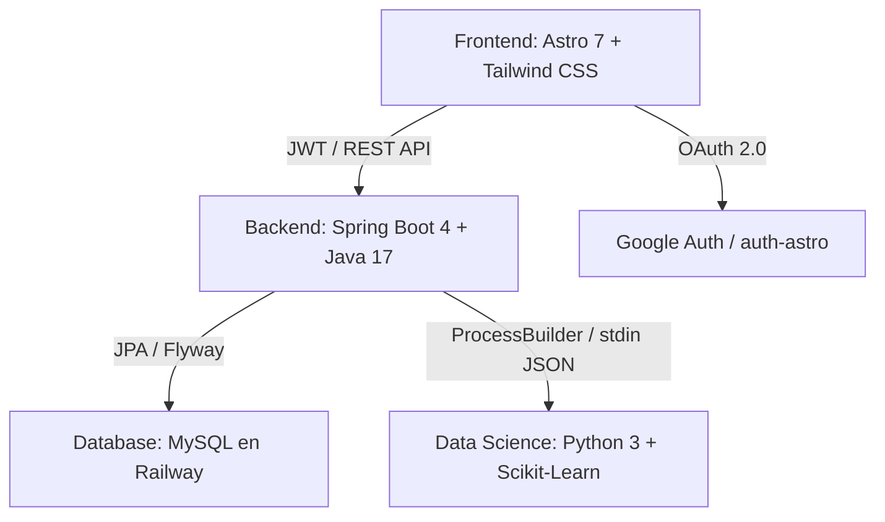

# Manual y Documentación Técnica Integral de FinanceAI

**Proyecto:** FinanceAI — Asistente Inteligente de Salud Financiera  
**Equipo:** No Country Simulation / G9-LATAM-Team-77  
**Fecha de Actualización:** 2026-08-21  

---

## 1. Arquitectura General del Sistema

FinanceAI es una plataforma integral de inteligencia financiera compuesta por tres capas principales:



---

## 2. Especificación de Módulos

### 2.1 Frontend (`Frontend/`)
- **Framework:** Astro 7.2 + TypeScript + Tailwind CSS.
- **Tipografía Global:** `Josefin Sans` (geométrica, elegante y moderna) para títulos, encabezados y logotipos; `Inter` para métricas numéricas y tablas.
- **Motor Multidivisa en Tiempo Real (`Frontend/src/lib/currency.ts`):**
  - Soporte para las 8 divisas oficiales: `USD`, `MXN`, `EUR`, `CRC`, `COP`, `ARS`, `CLP`, `PEN`.
  - Consulta diaria automática de tipos de cambio oficiales con almacenamiento en caché local (`localStorage` de 24h) y matriz de respaldo (*fallback*).
  - Ticker de cotización en vivo en el `Header` (ej. `1 USD ≈ $18.25 MXN`).
  - Barra de píldoras de cambio de moneda en el `Historial` para recalcular en caliente y en tiempo real los KPIs, la gráfica multi-línea con picos y la tabla de transacciones sin alterar los datos originales en la base de datos.
  - Al recargar la página (`F5`), el sistema restaura automáticamente la moneda configurada en el perfil del usuario.
- **Calendario Personalizado Glassmorphism:**
  - Componente visual interactivo compatible con **Modo Claro y Modo Oscuro**.
  - Selector de mes con matriz de 12 baldosas, navegador de años (`< 2026 >`) y límite estricto de 2 años atrás hasta la fecha actual de la máquina.
  - Reemplazo total del control nativo del navegador para una estética uniforme y moderna.
- **Sistema de Cierre de Sesión (Logout UX):**
  - Modal centrado superpuesto con desenfoque de fondo (`backdrop-blur-xl`).
  - Ocultamiento de la navegación, avatar y botones del Header durante la pantalla de logout para un diseño limpio y enfocado.
- **Servicio de Correos:** Integración con **Nodemailer** y Gmail configurado por variables de entorno con plantillas HTML de alta gama para envío de códigos de verificación de 6 dígitos al crear cuenta y restablecer contraseñas.
- **Seguridad y Validación:** Bloqueo estricto de emojis en formularios de registro, y guardias de protección de rutas síncronos en `/dashboard` e `/historial` que impiden acceder cambiando la URL sin autenticación previa.
- **Vistas Principales:**
  - `/login`: Formulario interactivo de acceso y registro con bloqueo de emojis, envío automático de correos con Nodemailer para verificación de cuenta, y flujo guiado en 3 pasos para restablecer contraseña.
  - `/dashboard`: Layout en 2 columnas balanceadas, selector de periodicidad (Mensual, Quincenal, Semanal, Diario) con restricción automática de fechas por tramo (máximo día actual), cálculo automático del nivel de endeudamiento y frecuencia de ahorro, animaciones fluidas de cálculo y conteo progresivo (*count-up*), clasificador de transacciones con 12 categorías oficiales (PR-02), medidor de Salud Financiera y motor de explicabilidad en 3 capas (DS-08).
  - `/historial`: Módulo analítico con filtros situados en la parte superior, selector de mes personalizado, rango de fechas (máximo 2 años atrás), botón para "Ver Todas las Transacciones Juntas", gráfica multi-línea con picos y fluctuaciones temporales, gráfico donut de categorías, conversor multidivisa en caliente, exportación a Excel (.CSV con UTF-8 BOM), exportación a PDF y modal seguro para borrar todo el historial.
  - `/logout`: Pantalla de cierre de sesión centrada con diseño glassmorphism, fondo desenfocado y destrucción sincronizada de tokens JWT y cookies de Google Auth.
- **Componente Header (`Header.astro`):**
  - Avatar circular con selector interactivo de 9 avatares ilustrados (o foto nativa de Google).
  - Selector de Moneda Base Predeterminada con sincronización en base de datos.
  - Botón de cierre grande `×` y cierre al hacer clic fuera del modal (*backdrop click*).
  - Zona de peligro con tipografía ampliada y confirmación de eliminación en cascada de la cuenta en MySQL.

### 2.2 Backend (`Backend/financeia-backend/`)
- **Framework:** Spring Boot 4.0.7 / Java 17.
- **Seguridad:** Spring Security con JWT Stateless (`JwtService.java`) y endpoints públicos para `/api/v1/auth/**`, `/api/v1/health` y `/api/v1/analisis-financiero`.
- **Sincronización con Google (`/api/v1/auth/google-sync`):** Intercepta sesiones de Google OAuth para crear o enlazar usuarios en MySQL y emitir tokens JWT válidos.
- **Eliminación en Cascada (`DELETE /api/v1/users/profile`):** Transacción atómica `@Transactional` que elimina permanentemente transacciones, historial de análisis y usuario de MySQL en Railway.
- **Integración con Data Science (`DataScienceService.java`):** Ejecuta subprocesos Python mediante `ProcessBuilder` y se comunica mediante flujos JSON en `stdin`/`stdout`.

### 2.3 Motor de Data Science e Inteligencia Artificial (`DataScient/`)
- **Reglas Oficiales PR-01 (Score de 0 a 100 puntos):**
  - **Componente Gasto/Ingreso (34 pts máx):** Gasto <=60% (34 pts), 60-90% (17 pts), >90% (0 pts).
  - **Componente Ahorro Real (33 pts máx):** Ahorro >=20% del ingreso (33 pts), 5-19% (16 pts), <5% (0 pts).
  - **Componente Endeudamiento (33 pts máx):** Deuda <=15% (33 pts), 16-35% (16 pts), >35% (0 pts).
  - **Semáforo:**
    -  **70 - 100 pts:** Saludable
    -  **40 - 69 pts:** En riesgo
    -  **0 - 39 pts:** Crítico
- **Independencia de Divisa:** Los modelos de Machine Learning y reglas operan sobre ratios adimensionales (`gastos / ingresos`, `ahorro / ingresos`), garantizando consistencia matemática idéntica sin importar la divisa utilizada.
- **Matriz de 12 Categorías Oficiales (PR-02):**
  - *Necesidades Básicas (50%):* Vivienda, Alimentación, Transporte, Servicios, Salud y bienestar, Educación.
  - *Estilo de Vida & Deseos (30%):* Entretenimiento, Compras, Cuidado personal, Regalos, Viajes, Otros.
  - *Ahorro & Deuda (20%):* Reservas líquidas y amortización de créditos.
- **Auto-cálculo de Métricas:** Inferencia de deuda a partir de gastos fijos y frecuencia de ahorro automática según excedente mensual.

---

## 3. Guía de Ejecución Rápida

### 3.1 Backend
```bash
cd Backend/financeia-backend
./mvnw spring-boot:run
```

### 3.2 Frontend
```bash
cd Frontend
npm run dev -- --host
```

### 3.3 Entorno Python
```bash
cd DataScient
python -m venv venv
./venv/Scripts/activate
pip install -r requirements.txt
```
