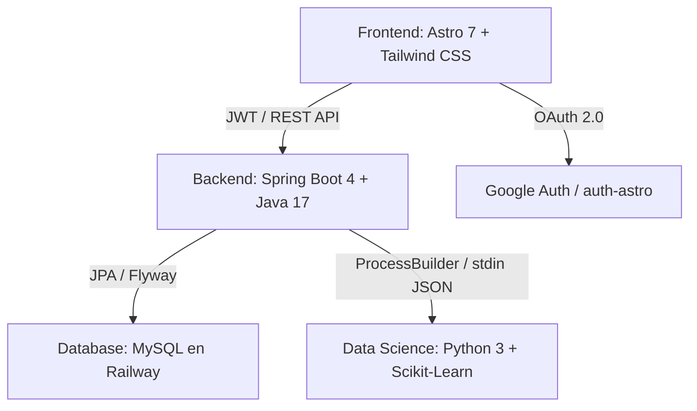

# Manual y Documentación Técnica Integral de FinanceAI

**Proyecto:** FinanceAI — Asistente Inteligente de Salud Financiera  
**Equipo:** No Country Simulation / G9-LATAM-Team-77  
**Fecha de Actualización:** 2026-08-20  

---

## 1. Arquitectura General del Sistema

FinanceAI es una plataforma integral de inteligencia financiera compuesta por tres capas principales:



---

## 2. Especificación de Módulos

### 2.1 Frontend (`Frontend/`)
- **Framework:** Astro 7.2 + TypeScript + Tailwind CSS.
- **Tipografía Global:** `Josefin Sans` (geométrica, elegante y moderna) para títulos, encabezados y logotipos; `Inter` para métricas numéricas y tablas.
- **Servicio de Correos:** Integración con **Nodemailer** y Gmail (`fernando.jose.reynosa@gmail.com`) con plantillas HTML de alta gama para envío de códigos de verificación de 6 dígitos al crear cuenta y restablecer contraseñas.
- **Seguridad y Validación:** Bloqueo estricto de emojis en formularios de registro, y guardias de protección de rutas síncronos en `/dashboard` e `/historial` que impiden acceder cambiando la URL sin autenticación previa.
- **Vistas Principales:**
  - `/login`: Formulario interactivo de acceso y registro con bloqueo de emojis, envío automático de correos con Nodemailer para verificación de cuenta, y flujo guiado en 3 pasos para restablecer contraseña.
  - `/dashboard`: Layout en 2 columnas balanceadas (sin scroll excesivo), selector de periodicidad (Mensual, Quincenal, Semanal) con restricción automática de fechas mínimas y máximas por tramo, cálculo automático del nivel de endeudamiento y frecuencia de ahorro, clasificador de transacciones con 12 categorías oficiales (PR-02), gráfica de líneas dinámica con Chart.js para la evolución temporal de gastos e ingresos, medidor de Salud Financiera y motor de explicabilidad en 3 capas (DS-08).
  - `/historial`: Módulo analítico con filtros por Año, Mes, Día y Período Rápido, gráficas de evolución temporal y distribución en donut, exportación a Excel (.CSV con UTF-8 BOM) y exportación a PDF estilizada.
  - `/logout`: Pantalla de cierre de sesión con diseño glassmorphism, fondo desenfocado y destrucción sincronizada de tokens JWT y cookies de Google Auth.
- **Componente Header (`Header.astro`):**
  - Avatar circular con selector interactivo de 9 avatares ilustrados (o foto nativa de Google).
  - Selector de Moneda Base Predeterminada (USD, CRC, MXN, EUR, COP, ARS, CLP, PEN).
  - Zona de peligro con confirmación para eliminación de cuenta.

### 2.2 Backend (`Backend/financeia-backend/`)
- **Framework:** Spring Boot 4.0.7 / Java 17.
- **Seguridad:** Spring Security con JWT Stateless (`JwtService.java`) y endpoints públicos para `/api/v1/auth/**`, `/api/v1/health` y `/api/v1/analisis-financiero`.
- **Sincronización con Google (`/api/v1/auth/google-sync`):** Intercepta sesiones de Google OAuth para crear o enlazar usuarios en MySQL y emitir tokens JWT válidos.
- **Integración con Data Science (`DataScienceService.java`):** Ejecuta subprocesos Python mediante `ProcessBuilder` y se comunica mediante flujos JSON en `stdin`/`stdout`.

### 2.3 Motor de Data Science e Inteligencia Artificial (`DataScient/`)
- **Reglas Oficiales PR-01 (Score de 0 a 100 puntos):**
  - **Componente Gasto/Ingreso (34 pts máx):** Gasto <=60% (34 pts), 60-90% (17 pts), >90% (0 pts).
  - **Componente Ahorro Real (33 pts máx):** Ahorro >=20% del ingreso (33 pts), 5-19% (16 pts), <5% (0 pts).
  - **Componente Endeudamiento (33 pts máx):** Deuda <=15% (33 pts), 16-35% (16 pts), >35% (0 pts).
  - **Semáforo:**
    - 🟢 **70 - 100 pts:** Saludable
    - ⚠️ **40 - 69 pts:** En riesgo
    - 🚨 **0 - 39 pts:** Crítico
- **Matriz de 12 Categorías Oficiales (PR-02):**
  - *Necesidades Básicas (50%):* Vivienda, Alimentación, Transporte, Servicios, Salud y bienestar, Educación.
  - *Estilo de Vida & Deseos (30%):* Entretenimiento, Compras, Cuidado personal, Regalos, Viajes, Otros.
  - *Ahorro & Deuda (20%):* Reservas líquidas y amortización de créditos.
- **Auto-cálculo de Métricas:** Inferencia de deuda a partir de gastos fijos y frecuencia de ahorro automática según excedente mensual.

---

## 3. Guía de Ejecución Rápida

### 3.1 Backend
```bash
cd Backend/financeia-backend
./mvnw spring-boot:run
```

### 3.2 Frontend
```bash
cd Frontend
npm run dev -- --host
```

### 3.3 Entorno Python
```bash
cd DataScient
python -m venv venv
./venv/Scripts/activate
pip install -r requirements.txt
```
