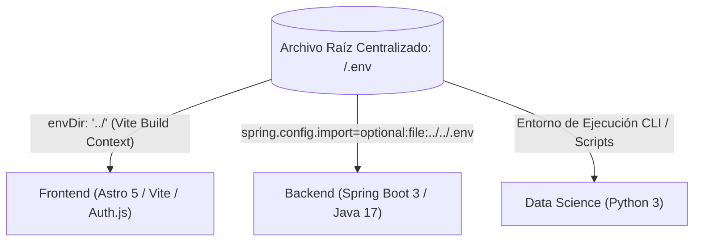
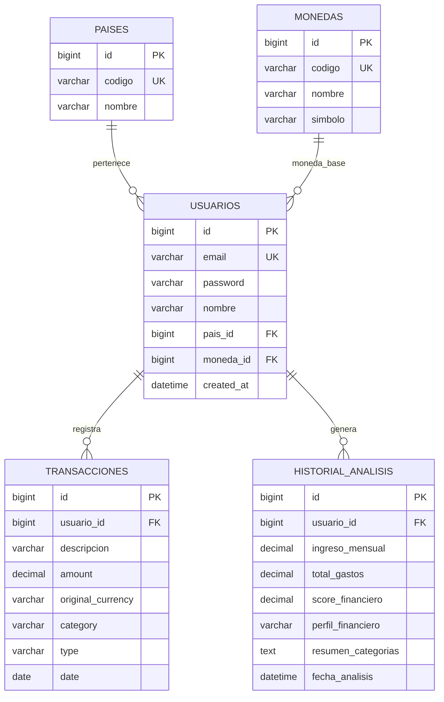
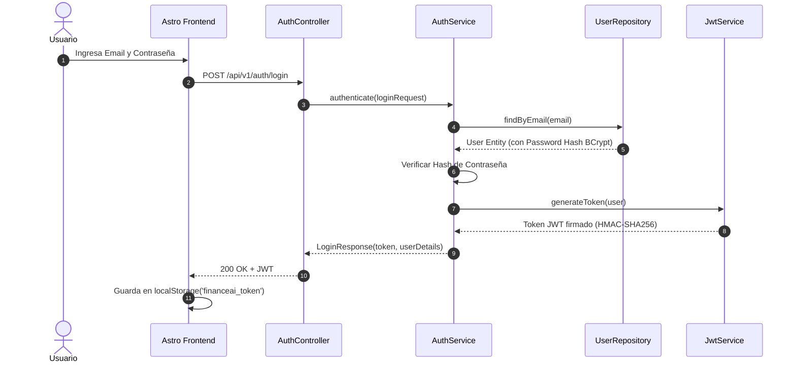
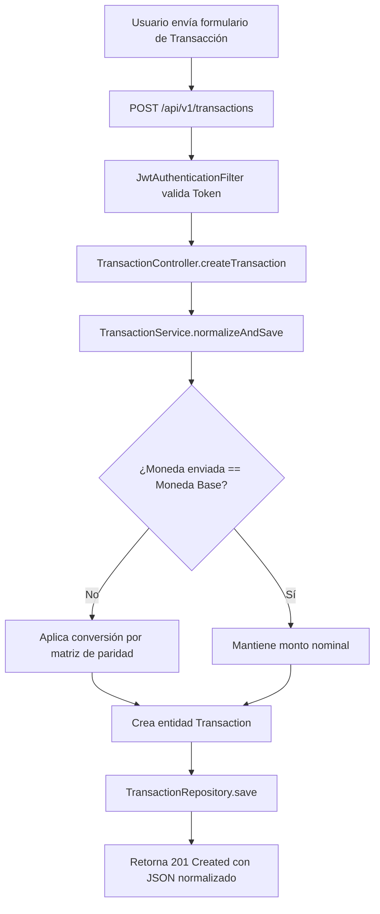
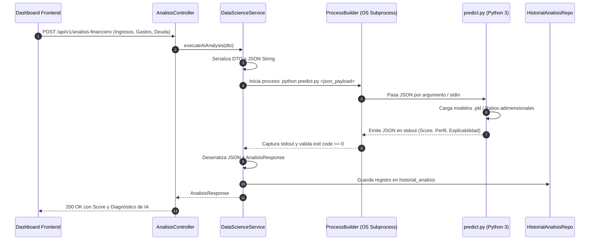
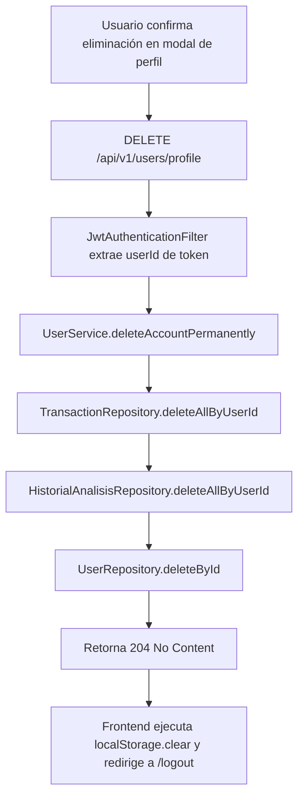
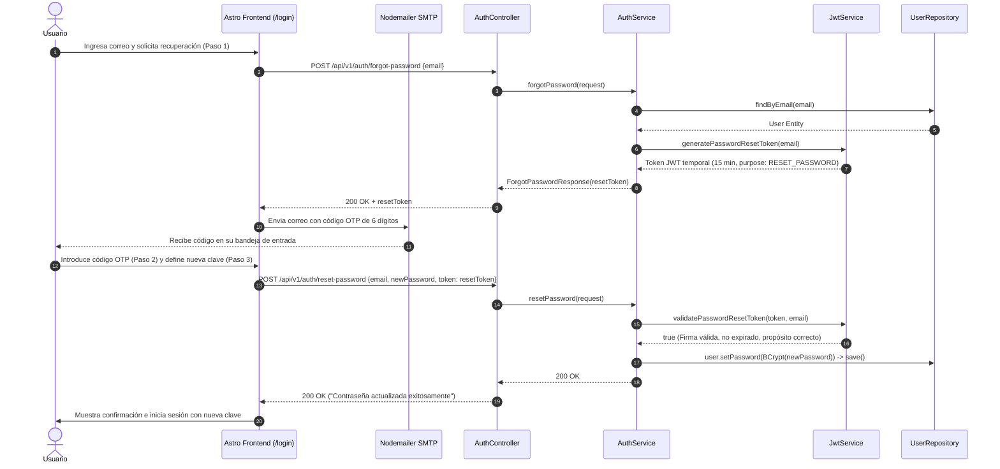
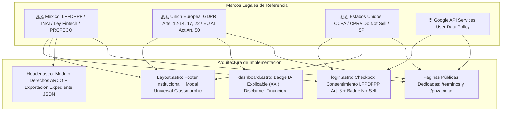

# DOCUMENTACIÓN DEFINITIVA DEL SISTEMA — FINANCEAI
> **Plataforma Integral de Salud Financiera con Inteligencia Artificial, Arquitectura Multi-Moneda y Monitoreo en Tiempo Real.**  
> *Versión Oficial Consolidada — G9-LATAM-Team-77*

---

## TABLA DE CONTENIDOS GENERAL

1. [Visión General y Arquitectura del Sistema](#1-visión-general-y-arquitectura-del-sistema)
   - [1.1 Arquitectura Centralizada de Variables de Entorno (.env)](#11-arquitectura-centralizada-de-variables-de-entorno-env)
2. [Módulo de Data Science & Machine Learning](#2-módulo-de-data-science--machine-learning)
   - [2.1 Formulación Matemática de Ratios Adimensionales](#21-formulación-matemática-de-ratios-adimensionales)
   - [2.2 Neutralidad Multidivisa en IA](#22-neutralidad-multidivisa-en-ia)
   - [2.3 Pipeline de Entrenamiento y Modelos](#23-pipeline-de-entrenamiento-y-modelos)
   - [2.4 Protocolo CLI de Inferencia Subprocess](#24-protocolo-cli-de-inferencia-subprocess)
   - [2.5 Matriz Heurística de Respaldo y Tolerancia a Fallos](#25-matriz-heurística-de-respaldo-y-tolerancia-a-fallos)
3. [Módulo Backend (Spring Boot 3 & Java 17 LTS)](#3-módulo-backend-spring-boot-3--java-17-lts)
   - [3.1 Tabla de Clases y Responsabilidades](#31-tabla-de-clases-y-responsabilidades)
   - [3.2 Esquema de Base de Datos y Entidades JPA](#32-esquema-de-base-de-datos-y-entidades-jpa)
   - [3.3 Catálogo Completo de Endpoints REST](#33-catálogo-completo-de-endpoints-rest)
   - [3.4 Diagramas de Flujo del Sistema (Mermaid)](#34-diagramas-de-flujo-del-sistema-mermaid)
4. [Módulo Frontend (Astro 5 & Tailwind CSS)](#4-módulo-frontend-astro-5--tailwind-css)
   - [4.1 Mapa del Sitio y Arquitectura de Rutas](#41-mapa-del-sitio-y-arquitectura-de-rutas)
   - [4.2 Sistema de Diseño, Tipografía y Regla Anti-Emojis](#42-sistema-de-diseño-tipografía-y-regla-anti-emojis)
   - [4.3 Catálogo de Estado y Persistencia (localStorage)](#43-catálogo-de-estado-y-persistencia-localstorage)
   - [4.4 Motor Multidivisa y Tabla Oficial de Equivalencias](#44-motor-multidivisa-y-tabla-oficial-de-equivalencias)
   - [4.5 UX Avanzado: Calendario Glassmorphic y Exportación Excel](#45-ux-avanzado-calendario-glassmorphic-y-exportación-excel)
   - [4.6 Política de Alta Seguridad en Contraseñas (Checklist Interactivo en Tiempo Real)](#46-política-de-alta-seguridad-en-contraseñas-checklist-interactivo-en-tiempo-real)
   - [4.7 Flujo de Notificaciones Toast Dinámicas con Emojis Expresivos](#47-flujo-de-notificaciones-toast-dinámicas-con-emojis-expresivos)
5. [Marco de Cumplimiento Legal, Privacidad y Gobernanza de IA](#5-marco-de-cumplimiento-legal-privacidad-y-gobernanza-de-ia)
   - [5.1 Legislación Mexicana (LFPDPPP, INAI, Ley Fintech, LMV y PROFECO)](#51-legislación-mexicana-lfpdppp-inai-ley-fintech-lmv-y-profeco)
   - [5.2 Normativa Internacional (GDPR, CCPA/CPRA Do Not Sell y EU AI Act)](#52-normativa-internacional-gdpr-ccpacpra-do-not-sell-y-eu-ai-act)
   - [5.3 Cumplimiento de la Política de Datos de Usuario de Google OAuth2](#53-cumplimiento-de-la-política-de-datos-de-usuario-de-google-oauth2)
   - [5.4 Protocolo de Derechos ARCO y Exportación JSON](#54-protocolo-de-derechos-arco-y-exportación-json)
   - [5.5 Gobernanza y Transparencia de Inteligencia Artificial (SDLC & XAI)](#55-gobernanza-y-transparencia-de-inteligencia-artificial-sdlc--xai)
   - [5.6 Deslinde Financiero (Financial Disclaimer) y Safe Harbor](#56-deslinde-financiero-financial-disclaimer-y-safe-harbor)
6. [Guía Maestra: Cómo Levantar Todo el Sistema Paso a Paso (Pro)](#6-guía-maestra-cómo-levantar-todo-el-sistema-paso-a-paso-pro)
   - [6.1 Requisitos Previos y Entorno Oficial de Compilación](#61-requisitos-previos-y-entorno-oficial-de-compilación)
   - [6.2 Paso 1: Configuración de Variables de Entorno Centralizadas](#62-paso-1-configuración-de-variables-de-entorno-centralizadas)
   - [6.3 Paso 2: Inicialización del Entorno Python (Data Science)](#63-paso-2-inicialización-del-entorno-python-data-science)
   - [6.4 Paso 3: Compilación y Ejecución del Backend Spring Boot](#64-paso-3-compilación-y-ejecución-del-backend-spring-boot)
   - [6.5 Paso 4: Ejecución del Frontend Astro](#65-paso-4-ejecución-del-frontend-astro)
   - [6.6 Paso 5: Despliegue con Docker / Docker Compose](#66-paso-5-despliegue-con-docker--docker-compose)
7. [Manejo de Errores Comunes y Preguntas Frecuentes](#7-manejo-de-errores-comunes-y-preguntas-frecuentes)

---

## 1. VISIÓN GENERAL Y ARQUITECTURA DEL SISTEMA

FinanceAI es una solución integral orientada a la salud financiera de usuarios individuales y PyMEs en Latinoamérica. El entorno oficial de compilación y ejecución está estandarizado en **Java 17 LTS (OpenJDK 17 / Microsoft Build ms-17.0.20.1)** y **Spring Boot 3**, garantizando máxima estabilidad empresarial, rendimiento optimizado y compatibilidad multi-plataforma.

La arquitectura del sistema está desacoplada en tres capas principales que interactúan mediante contratos REST y flujos de procesos estándar:


### 1.1 Arquitectura Centralizada de Variables de Entorno (.env)

El proyecto implementa el principio de **Fuente Única de Verdad (Single Source of Truth)** para la configuración sensible mediante un único archivo `.env` ubicado en la raíz del repositorio (`C:\Java\G9-LATAM-Team-77\.env`).



- **Frontend (Astro / Vite):** En `astro.config.mjs`, se define la directiva `vite: { envDir: '../' }`, permitiendo que Astro y Auth.js consuman directamente variables públicas (`PUBLIC_API_URL`, `SITE_URL`) y privadas (`AUTH_SECRET`, `GOOGLE_CLIENT_ID`, `GMAIL_PASS`) sin requerir archivos duplicados.
- **Backend (Spring Boot):** En `application.properties`, se configura `spring.config.import=optional:file:../../.env`, mapeando de forma nativa variables como `${MYSQLUSER}`, `${MYSQL_ROOT_PASSWORD}`, `${JWT_SECRET}` y `${CORS_ALLOWED_ORIGINS}` sin inconsistencias de despliegue.

---

## 2. MÓDULO DE DATA SCIENCE & MACHINE LEARNING

Ubicación del código fuente: `C:\Java\G9-LATAM-Team-77\DataScient`

### 2.1 Formulación Matemática de Ratios Adimensionales

El motor de Machine Learning no evalúa magnitudes absolutas en dinero para diagnosticar la salud financiera; en su lugar, transforma los datos financieros en **ratios adimensionales normalizados**:

1. **Ratio de Gasto sobre Ingreso ($R_{GI}$):**
   $$R_{GI} = \frac{\sum \text{Gastos Mensuales}}{\text{Ingreso Mensual}}$$
2. **Tasa de Ahorro Real ($R_{Ahorro}$):**
   $$R_{Ahorro} = \frac{\max(0, \text{Ingreso Mensual} - \sum \text{Gastos})}{\text{Ingreso Mensual}}$$
3. **Ratio de Endeudamiento Mensual ($R_{Deuda}$):**
   $$R_{Deuda} = \frac{\text{Cuotas de Deuda Mensual}}{\text{Ingreso Mensual}}$$
4. **Ponderaciones por Tipo de Gasto:**
   $$\% \text{ Gasto Esencial} = \frac{\text{Gastos Básicos (Vivienda, Comida, Servicios, Transporte)}}{\text{Ingreso Mensual}}$$
   $$\% \text{ Gasto Discrecional} = \frac{\text{Gastos Estilo de Vida (Entretenimiento, Compras, Salidas)}}{\text{Ingreso Mensual}}$$

### 2.2 Neutralidad Multidivisa en IA

Gracias al uso de variables adimensionales, **el modelo de IA es 100% independiente de la divisa**.  
Dado que tanto el numerador como el denominador se expresan en la misma moneda del usuario (`USD`, `MXN`, `EUR`, `CRC`, `COP`, `ARS`, `CLP`, `PEN`), la unidad monetaria se cancela matemáticamente:

$$\text{Ejemplo: } \frac{\$1,500 \text{ USD Gastos}}{\$3,000 \text{ USD Ingresos}} = 0.50 \equiv \frac{\$25,500 \text{ MXN Gastos}}{\$51,000 \text{ MXN Ingresos}} = 0.50$$

El score predictivo y las recomendaciones de ahorro resultantes son idénticos y matemáticamente justos para cualquier país.

### 2.3 Pipeline de Entrenamiento y Modelos

El archivo `src/train_models.py` gestiona el pipeline de aprendizaje supervisado:

1. **Modelo de Clasificación de Transacciones (`transaction_model.pkl`):**
   - **Algoritmo:** `LogisticRegression(max_iter=1000)` precedido por `TfidfVectorizer(max_features=5000)`.
   - **Objetivo:** Clasificar texto libre de transacciones (ej: *"Starbucks reforma"*, *"Uber al trabajo"*) en categorías financieras oficiales (`Alimentación`, `Transporte`, `Vivienda`, `Servicios`, etc.).
   - **Métrica:** Precisión en test $> 95\%$.
2. **Modelo de Perfil Financiero (`profile_model.pkl`):**
   - **Algoritmo:** `RandomForestClassifier(n_estimators=100, random_state=42)`.
   - **Objetivo:** Predecir categoría de riesgo: `Saludable`, `En observación` o `En riesgo`.
   - **Métrica:** Accuracy $> 98\%$ en datos de validación cruzada.

### 2.4 Protocolo CLI de Inferencia Subprocess

El script `src/predict.py` se comunica con el backend Spring Boot vía flujos estándar `stdin` / `stdout` o argumentos `argv`:

- **Payload de Entrada (JSON vía stdin):**
  ```json
  {
    "type": "full_analysis",
    "ingreso_mensual": 3000.0,
    "gastos_mensuales": 1200.0,
    "deuda_total": 450.0,
    "transacciones": [
      { "descripcion": "Supermercado Walmart", "valor": 350.0 },
      { "descripcion": "Renta departamento", "valor": 600.0 }
    ]
  }
  ```
- **Payload de Salida (JSON vía stdout):**
  ```json
  {
    "status": "success",
    "score_financiero": 85.0,
    "perfil_financiero": "Saludable",
    "explicabilidad_ds08": {
      "diagnostico": "Tu salud financiera está en nivel Saludable (Score 85/100).",
      "causa_principal": "Factor determinante: tu nivel de endeudamiento está por debajo del 15%.",
      "accion_recomendada": "Mantén tu fondo de ahorro mensual e invierte excedentes."
    },
    "recomendaciones": [
      "Felicidades por mantener un gasto menor al 50% de tus ingresos.",
      "Destina un 10% adicional a inversión diversificada."
    ]
  }
  ```

### 2.5 Matriz Heurística de Respaldo y Tolerancia a Fallos

Si el archivo `.pkl` no se encuentra o el proceso sufre alguna excepción por datos extremos:
- El sistema activa un **motor de reglas determinísticas (Fallback Heurístico)** basado en la regla clásica `50-30-20`.
- Control de división por cero: Si el ingreso mensual es `$0`, se asigna automáticamente una penalización estructurada sin provocar caídas del proceso.

---

## 3. MÓDULO BACKEND (SPRING BOOT 3 & JAVA 17 LTS)

Ubicación del código fuente: `C:\Java\G9-LATAM-Team-77\Backend\financeia-backend`

### 3.1 Tabla de Clases y Responsabilidades

| Clase | Paquete | Rol | Responsabilidad Principal |
| :--- | :--- | :--- | :--- |
| `FinanceiaBackendApplication` | `com.financeia` | Main | Punto de entrada e inicio del contexto Spring Boot. |
| `SecurityConfig` | `config` | Seguridad | Configuración de CORS, CSRF deshabilitado, Stateless Session y filtros JWT. |
| `JwtAuthenticationFilter` | `config` | Filtro HTTP | Intercepta cada petición, extrae `Bearer <token>`, valida firma y establece el `SecurityContext`. |
| `AuthController` | `controllers` | REST Controller | Autenticación (`/login`, `/register`, `/google-sync`, `/reset-password`). |
| `AnalisisController` | `controllers` | REST Controller | Inicia análisis de salud financiera con la IA (`/analisis-financiero`). |
| `DashboardController` | `controllers` | REST Controller | Agregación de KPIs, gastos por categoría y series temporales (`/dashboard`). |
| `TransactionController` | `controllers` | REST Controller | CRUD de transacciones financieras y normalización de montos (`/transactions`). |
| `UserController` | `controllers` | REST Controller | Gestión de perfil, moneda base y eliminación en cascada (`/users/profile`). |
| `HealthController` | `controllers` | REST Controller | Endpoint de disponibilidad y monitoreo del backend (`/health`). |
| `DataScienceService` | `service` | Integración IA | Ejecuta `ProcessBuilder` invocando `predict.py` y mapea respuestas a entidades. |
| `TransactionService` | `service` | Lógica Negocio | Persistencia, clasificación de flujos y cálculos de totales acumulados. |
| `AuthService` | `service` | Lógica Negocio | Registro con encriptación BCrypt y autenticación de credenciales. |
| `JwtService` | `service` | Criptografía | Generación, expiración y firma HMAC-SHA256 de tokens JWT. |
| `UserService` | `service` | Lógica Negocio | Actualizaciones de perfil y borrado atómico total de registros (`DELETE`). |
| `UserRepository` | `repository` | JPA Data Access | Interfaz de acceso a la tabla `usuarios`. |
| `TransactionRepository` | `repository` | JPA Data Access | Interfaz de acceso a la tabla `transacciones`. |
| `HistorialAnalisisRepository` | `repository` | JPA Data Access | Interfaz de acceso a la tabla `historial_analisis`. |
| `GlobalExceptionHandler` | `exception` | Manejador Errores | Captura de excepciones globales y respuestas con formato RFC 7807. |

### 3.2 Esquema de Base de Datos y Entidades JPA



### 3.3 Catálogo Completo de Endpoints REST

| Método | URL | Descripción | Autenticación | Request Body | Códigos de Respuesta |
| :--- | :--- | :--- | :---: | :--- | :--- |
| `POST` | `/api/v1/auth/register` | Registro de nuevo usuario | Pública | `{"email", "password", "nombre"}` | `201 Created`, `400 Bad Request` |
| `POST` | `/api/v1/auth/login` | Login con email y contraseña | Pública | `{"email", "password"}` | `200 OK` (con JWT), `401 Unauthorized` |
| `POST` | `/api/v1/auth/google-sync` | Sincronización de sesión OAuth2 Google | Pública | `{"email", "name", "googleId"}` | `200 OK` (con JWT) |
| `POST` | `/api/v1/auth/forgot-password` | **Solicitud de token temporal de recuperación (15 min)** | Pública | `{"email"}` | `200 OK` (con `resetToken`), `404 Not Found` |
| `POST` | `/api/v1/auth/reset-password` | **Restablecimiento de contraseña con validación de token** | Pública | `{"email", "newPassword", "token"}` | `200 OK`, `400 Bad Request` |
| `GET` | `/api/v1/users/profile` | Obtiene el perfil del usuario autenticado | `Bearer JWT` | Ninguno | `200 OK` |
| `PUT` | `/api/v1/users/profile` | Actualiza moneda base y país del usuario | `Bearer JWT` | `{"paisId", "monedaId"}` | `200 OK` |
| `DELETE`| `/api/v1/users/profile` | **Elimina la cuenta y todos sus datos en cascada** | `Bearer JWT` | Ninguno | `204 No Content` |
| `GET` | `/api/v1/transactions` | Lista todas las transacciones del usuario | `Bearer JWT` | Ninguno (Query params opcionales) | `200 OK` |
| `POST` | `/api/v1/transactions` | Crea una nueva transacción | `Bearer JWT` | `{"description", "amount", "category", "type", "date"}` | `201 Created` |
| `GET` | `/api/v1/dashboard/summary` | Obtiene resumen consolidado para el Dashboard | `Bearer JWT` | Ninguno | `200 OK` |
| `GET` | `/api/v1/dashboard/history` | Obtiene series temporales para gráficas | `Bearer JWT` | Ninguno | `200 OK` |
| `POST` | `/api/v1/analisis-financiero`<br/>*(alias: `/analisis-financiero`)* | **Ejecuta el análisis de IA (Bridge a Python)** | Pública / `Bearer JWT` | `{"ingreso_mensual", "transacciones": [...]}` | `200 OK` (Score + Diagnóstico + Categorización) |
| `GET` | `/api/v1/health` | Health Check de liveness y readiness | Pública | Ninguno | `200 OK` (`{"status": "UP"}`) |

#### 3.3.1 Casos de Uso Prácticos: Análisis y Recomendaciones con IA (`POST /api/v1/analisis-financiero`)

El endpoint soporta dos modalidades de consumo según el contexto de integración y conveniencia del cliente:

---

##### 🟢 Caso 1: Modo Automático Simplificado (Recomendado para Frontend & App Móvil)
**Cuándo usarlo:** Cuando el usuario final interactúa con la plataforma registrando sus ingresos y transacciones reales. El sistema evita fricción al no exigirle al usuario que calcule su endeudamiento ni su frecuencia de ahorro. La IA clasifica los conceptos por NLP (`Supermercado` ➔ `Alimentación`, `Combustible` ➔ `Transporte`, etc.), totaliza los egresos, deduce la tasa de ahorro y calcula el endeudamiento a partir de los gastos fijos.

**Entrada en Postman (`POST http://localhost:8080/api/v1/analisis-financiero`):**
```json
{
  "ingreso_mensual": 4500,
  "transacciones": [
    { "descripcion": "Supermercado", "valor": 420 },
    { "descripcion": "Combustible", "valor": 300 },
    { "descripcion": "Streaming", "valor": 40 }
  ]
}
```

**Salida (`200 OK`):**
```json
{
  "status": "success",
  "score_financiero": 83,
  "perfil_financiero": "Saludable",
  "probabilidad": 0.92,
  "ingreso_mensual": 4500.0,
  "total_gastos": 760.0,
  "ahorro_estimado": 3740.0,
  "nivel_endeudamiento": 0.0,
  "frecuencia_ahorro": "Alta",
  "periodicidad": "mensual",
  "moneda": "USD",
  "resumen_gastos": {
    "Alimentación": 420.0,
    "Transporte": 300.0,
    "Entretenimiento": 40.0
  },
  "transacciones_categorizadas": [
    { "descripcion": "Supermercado", "valor": 420.0, "categoria": "Alimentación" },
    { "descripcion": "Combustible", "valor": 300.0, "categoria": "Transporte" },
    { "descripcion": "Streaming", "valor": 40.0, "categoria": "Entretenimiento" }
  ],
  "categorias_detectadas": ["Alimentación", "Transporte", "Entretenimiento"],
  "recomendaciones": [
    "Tu salud financiera está en nivel Saludable (83/100). Tus finanzas muestran un equilibrio óptimo entre ingresos, gastos operativos y capacidad de ahorro.",
    "Factor determinante: tu relación Gasto/Ingreso — estás destinando el 17% de tu ingreso a gastos corrientes, manteniendo un margen amplio de liquidez.",
    "Mantén tu disciplina de presupuesto y destina al menos 5% adicional de tus excedentes a instrumentos de inversión o fondos de liquidez."
  ],
  "explicabilidad_ds08": {
    "diagnostico": "Tu salud financiera está en nivel Saludable (83/100). Tus finanzas muestran un equilibrio óptimo entre ingresos, gastos operativos y capacidad de ahorro.",
    "causa_principal": "Factor determinante: tu relación Gasto/Ingreso — estás destinando el 17% de tu ingreso a gastos corrientes, manteniendo un margen amplio de liquidez.",
    "accion_recomendada": "Mantén tu disciplina de presupuesto y destina al menos 5% adicional de tus excedentes a instrumentos de inversión o fondos de liquidez.",
    "pilar_debil": "gasto_ingreso"
  }
}
```

---

##### 🔵 Caso 2: Modo Explícito con Parámetros Precalculados (Para Integraciones / Simuladores Externos)
**Cuándo usarlo:** Cuando un sistema externo, simulación financiera o formulario bancario ya dispone de métricas de endeudamiento crediticio (ej. `25%`) y un hábito declarado de ahorro (ej. `"Media"`), y desea que la IA pondere estos valores explícitos en el cálculo del score global y las advertencias de deuda.

**Entrada en Postman (`POST http://localhost:8080/api/v1/analisis-financiero`):**
```json
{
  "ingreso_mensual": 4500,
  "nivel_endeudamiento": 25,
  "frecuencia_ahorro": "Media",
  "transacciones": [
    { "descripcion": "Supermercado", "valor": 420 },
    { "descripcion": "Combustible", "valor": 300 },
    { "descripcion": "Streaming", "valor": 40 }
  ]
}
```

**Salida (`200 OK`):**
```json
{
  "status": "success",
  "score_financiero": 83,
  "perfil_financiero": "Saludable",
  "probabilidad": 0.92,
  "ingreso_mensual": 4500.0,
  "total_gastos": 760.0,
  "ahorro_estimado": 3740.0,
  "nivel_endeudamiento": 25.0,
  "frecuencia_ahorro": "Alta",
  "periodicidad": "mensual",
  "moneda": "USD",
  "resumen_gastos": {
    "Alimentación": 420.0,
    "Transporte": 300.0,
    "Entretenimiento": 40.0
  },
  "transacciones_categorizadas": [
    { "descripcion": "Supermercado", "valor": 420.0, "categoria": "Alimentación" },
    { "descripcion": "Combustible", "valor": 300.0, "categoria": "Transporte" },
    { "descripcion": "Streaming", "valor": 40.0, "categoria": "Entretenimiento" }
  ],
  "categorias_detectadas": ["Alimentación", "Transporte", "Entretenimiento"],
  "recomendaciones": [
    "Tu salud financiera está en nivel Saludable (83/100). Tus finanzas muestran un equilibrio óptimo entre ingresos, gastos operativos y capacidad de ahorro.",
    "Factor determinante: tu nivel de endeudamiento — el 25% de tus ingresos está comprometido en obligaciones fijas o pasivos.",
    "Considera amortizaciones anticipadas a capital en créditos de tasa variable para blindar tu patrimonio."
  ],
  "explicabilidad_ds08": {
    "diagnostico": "Tu salud financiera está en nivel Saludable (83/100). Tus finanzas muestran un equilibrio óptimo entre ingresos, gastos operativos y capacidad de ahorro.",
    "causa_principal": "Factor determinante: tu nivel de endeudamiento — el 25% de tus ingresos está comprometido en obligaciones fijas o pasivos.",
    "accion_recomendada": "Considera amortizaciones anticipadas a capital en créditos de tasa variable para blindar tu patrimonio.",
    "pilar_debil": "endeudamiento",
    "desglose_pilares": {
      "gasto_ingreso": { "pts": 34.0, "max": 34.0, "pct": 100.0 },
      "ahorro": { "pts": 33.0, "max": 33.0, "pct": 100.0 },
      "endeudamiento": { "pts": 16.0, "max": 33.0, "pct": 48.5 }
    }
  }
}
```

---

#### 3.3.2 Catálogo de Valores Permitidos para `frecuencia_ahorro`

El motor de Machine Learning y normalización de texto procesa de forma tolerante e insensible a mayúsculas/minúsculas (`case-insensitive`) las siguientes opciones:

| Categoría Normalizada | Valores Aceptados en Postman / JSON | Comportamiento del Motor IA |
| :--- | :--- | :--- |
| **Alta** | `"Alta"`, `"alta"`, `"Diaria"`, `"Semanal"`, `"Frecuente"`, `"Constante"`, `"Muy alta"` | Asigna evaluación óptima al pilar de ahorro ($33/33$ pts) y emite recomendaciones de consolidación de patrimonio. |
| **Media** | `"Media"`, `"media"`, `"Quincenal"`, `"Mensual"`, `"Regular"`, `"Moderada"` | Asigna evaluación intermedia ($16/33$ pts) y sugiere incrementar el porcentaje de ahorro periódico. |
| **Baja** | `"Baja"`, `"baja"`, `"Ocasional"`, `"Anual"`, `"Rara vez"`, `"Nunca"`, `"Nula"`, `"Ninguna"`, `"Cero"` | Asigna $0/33$ pts en hábito y emite alertas urgentes para apartar un fondo de contingencia mínimo. |
| **Automática (`AUTO`)** | No enviada, `null`, `""`, `"AUTO"`, `"indefinido"` o texto desconocido | **Deducción Matemática Inteligente:** La IA calcula $\text{Ratio} = \frac{\text{Ahorro Estimado}}{\text{Ingreso Mensual}}$. Si $\ge 25\% \rightarrow \text{Alta}$, si $\ge 8\% \rightarrow \text{Media}$, si $< 8\% \rightarrow \text{Baja}$. |

---

#### 3.3.3 Reglas del Rango de `nivel_endeudamiento` ($0\%$ a $100\%$) y Clampeado Defensivo

El campo `nivel_endeudamiento` mide el porcentaje de los ingresos brutos del usuario comprometido en pasivos, créditos o amortizaciones fijas.

1. **Rango Oficial Válido:** **`0.0` a `100.0`** (escala porcentual).
2. **Puntuación Ponderada en el Score PR-01:**
   - $\le 15.0\%$: Excelente ($33/33$ pts).
   - $15.1\% - 35.0\%$: Moderado ($16/33$ pts).
   - $> 35.0\%$: Crítico ($0/33$ pts).
3. **Manejo de Valores Negativos ($< 0\%$):**
   - Si se envía un valor negativo como `-25` o `-100`, el sistema aplica **normalización defensiva a `0.0%`** (ya que financieramente no existe la deuda negativa en un diagnóstico presupuestario).
4. **Manejo de Valores Desbordados ($> 100\%$):**
   - Si se envía un valor superior a 100 como `150` o `500`, el sistema aplica **clampeado defensivo a `100.0%`**. Otorga $0$ puntos en deuda y activa el semáforo en nivel **Riesgo/Crítico** con recomendaciones prioritarias de reestructuración crediticia.

---

#### 3.3.4 Manejo de Errores y Validaciones de Entrada (HTTP 400 Bad Request)

Para prevenir caídas, fallos de seguridad o ataques de inyección, la capa de Spring Boot (Jackson & Bean Validation) y el motor Python implementan las siguientes respuestas estructuradas ante datos erróneos:

| Tipo de Error en Entrada | Ejemplo de Payload Erróneo | Código HTTP | Mensaje de Respuesta del Servidor |
| :--- | :--- | :---: | :--- |
| **Letras en campos numéricos** | `{"ingreso_mensual": "cuatro mil"}` | `400 Bad Request` | `JSON parse error: Cannot deserialize value of type java.math.BigDecimal from String "cuatro mil"` |
| **Letras en endeudamiento** | `{"nivel_endeudamiento": "mucho"}` | `400 Bad Request` | `JSON parse error: Cannot deserialize value of type java.math.BigDecimal from String "mucho"` |
| **Símbolos / formato moneda** | `{"valor": "$500 USD"}` | `400 Bad Request` | `JSON parse error: Cannot deserialize value of type java.math.BigDecimal from String "$500 USD"` |
| **Ingreso mensual negativo** | `{"ingreso_mensual": -1500}` | `400 Bad Request` | `El ingreso mensual no puede ser negativo` (Bean Validation `@PositiveOrZero`) |
| **JSON malformado o roto** | `{"ingreso_mensual": 4500, }` | `400 Bad Request` | `JSON parse error: Unexpected character (',')...` |

---

#### 3.3.5 Matriz de 20 Casos de Prueba Ejecutados y Certificados

La siguiente matriz resume la ejecución automatizada de 20 escenarios de prueba contra el motor de inferencia de FinanceAI:

| ID | Escenario de Prueba | Payload de Entrada Relevante | Score | Perfil Resultante | Deuda Efectiva | Frecuencia Resultante | Estado |
| :---: | :--- | :--- | :---: | :---: | :---: | :---: | :---: |
| **T01** | Modo Automático Completo | `ingreso: 4500`, `txs: 3 items ($760)` | **100** | Saludable | 0.0% (auto) | Alta (auto) | `200 OK` |
| **T02** | Frecuencia explícita `"Alta"` | `ingreso: 3000`, `frecuencia: "Alta"` | **100** | Saludable | 0.0% | Alta | `200 OK` |
| **T03** | Frecuencia explícita `"Media"` | `ingreso: 3000`, `frecuencia: "Media"` | **100** | Saludable | 0.0% | Media | `200 OK` |
| **T04** | Frecuencia explícita `"Baja"` | `ingreso: 3000`, `frecuencia: "Baja"` | **100** | Saludable | 0.0% | Baja | `200 OK` |
| **T05** | Frecuencia temporal `"Semanal"` | `ingreso: 2000`, `frecuencia: "Semanal"` | **100** | Saludable | 0.0% | Alta (mapeado) | `200 OK` |
| **T06** | Frecuencia temporal `"Quincenal"`| `ingreso: 2000`, `frecuencia: "Quincenal"`| **100** | Saludable | 0.0% | Media (mapeado) | `200 OK` |
| **T07** | Frecuencia temporal `"Mensual"` | `ingreso: 2000`, `frecuencia: "Mensual"` | **100** | Saludable | 0.0% | Media (mapeado) | `200 OK` |
| **T08** | Frecuencia nula `"Nunca"` | `ingreso: 2000`, `frecuencia: "Nunca"` | **100** | Saludable | 0.0% | Baja (mapeado) | `200 OK` |
| **T09** | Frecuencia minúsculas `"alta"` | `ingreso: 2500`, `frecuencia: "alta"` | **100** | Saludable | 0.0% | Alta (tolerante) | `200 OK` |
| **T10** | Frecuencia desconocida | `ingreso: 4000`, `frecuencia: "indefinido"` | **100** | Saludable | 0.0% | Alta (auto-fallback) | `200 OK` |
| **T11** | Deuda Límite Mínimo ($0\%$) | `ingreso: 5000`, `deuda: 0` | **100** | Saludable | 0.0% | Alta | `200 OK` |
| **T12** | Deuda Moderada ($25\%$) | `ingreso: 5000`, `deuda: 25` | **83** | Saludable | 25.0% | Alta | `200 OK` |
| **T13** | Deuda Límite Máximo ($100\%$) | `ingreso: 5000`, `deuda: 100` | **67** | Riesgo | 100.0% | Alta | `200 OK` |
| **T14** | Deuda Desbordada ($150\%$) | `ingreso: 3000`, `deuda: 150` | **67** | Riesgo | 100.0% (clampeado) | Alta | `200 OK` |
| **T15** | Deuda Desbordada ($500\%$) | `ingreso: 2000`, `deuda: 500` | **67** | Riesgo | 100.0% (clampeado) | Alta | `200 OK` |
| **T16** | Deuda Negativa ($-25\%$) | `ingreso: 3000`, `deuda: -25` | **100** | Saludable | 0.0% (normalizado) | Alta | `200 OK` |
| **T17** | Deuda Negativa ($-100\%$) | `ingreso: 3000`, `deuda: -100` | **100** | Saludable | 0.0% (normalizado) | Alta | `200 OK` |
| **T18** | Sin Transacciones (`[]`) | `ingreso: 3000`, `transacciones: []` | **100** | Saludable | 0.0% | Alta | `200 OK` |
| **T19** | Sobrepaso de Gastos Crítico | `ingreso: 1000`, `gastos: $1400` | **0** | Crítico | 80.0% (fijos auto) | Baja (auto) | `200 OK` |
| **T20** | Frecuencia `"Ocasional"` | `ingreso: 3500`, `frecuencia: "ocasional"`| **100** | Saludable | 0.0% | Baja (mapeado) | `200 OK` |

### 3.4 Diagramas de Flujo del Sistema (Mermaid)

#### Flujo 1: Registro y Autenticación con Emisión de Token JWT


#### Flujo 2: Ingesta de Transacciones y Normalización de Divisas


#### Flujo 3: Ejecución del Puente de Inferencia IA (Spring Boot ➔ Python CLI)


#### Flujo 4: Eliminación Total de Cuenta en Cascada (*Danger Zone*)


#### Flujo 5: Recuperación de Contraseña con Token Temporal JWT (15 Minutos)


---

## 4. MÓDULO FRONTEND (ASTRO 5 & TAILWIND CSS)

Ubicación del código fuente: `C:\Java\G9-LATAM-Team-77\Frontend`

### 4.1 Mapa del Sitio y Arquitectura de Rutas

| Ruta | Archivo Astro | Tipo de Renderizado | Guardias de Acceso | Propósito |
| :--- | :--- | :---: | :---: | :--- |
| `/` | `index.astro` | SSR / Redirige | Condicional | Redirecciona a `/dashboard` si hay token, de lo contrario a `/login`. |
| `/login` | `login.astro` | SSR / Client Hydration | Público | Inicio de sesión, registro interactivo, OAuth2 Google y recuperación. |
| `/dashboard` | `dashboard.astro` | SSR + Client Scripts | **Protegido (Token)** | Registro de movimientos (diario/semanal/mensual), velocímetro de Score y análisis de IA. |
| `/historial` | `historial.astro` | SSR + Client Scripts | **Protegido (Token)** | Visualización temporal con picos, filtros de mes/rango, conversor de divisas y exportación Excel. |
| `/terminos` | `terminos.astro` | SSR / Client Hydration | Público / Dinámico | Términos de Servicio, exclusión Ley Fintech, LMV y 10 pilares OWASP. Navegación contextual automática. |
| `/privacidad` | `privacidad.astro` | SSR / Client Hydration | Público / Dinámico | Aviso de Privacidad Integral conforme a LFPDPPP, GDPR y CCPA Do Not Sell. Navegación contextual automática. |
| `/logout` | `logout.astro` | SSR | Público | Pantalla de cierre de sesión centrada con fondo difuminado y confirmación. |

### 4.2 Sistema de Diseño, Tipografía y Regla Anti-Emojis

- **Tipografía Oficial:**
  - **Titulares, Logotipo y Badges:** `Josefin Sans` (elegante, geométrica y moderna).
  - **Métricas, Tablas, Formularios y Datos:** `Inter` (alta legibilidad técnica).
- **Esquema de Color Dual (Light / Dark Mode):**
  - *Modo Claro:* Fondos `bg-gray-50`, tarjetas `bg-white`, bordes `border-gray-200`, textos `text-gray-900`.
  - *Modo Oscuro:* Fondos `dark:bg-gray-950`, tarjetas `dark:bg-gray-900`, bordes `dark:border-gray-800`, textos `dark:text-white`.
- **Regla Estricta Anti-Emojis:**
  - Se prohíbe el uso de emojis crudos en la interfaz de usuario.
  - Toda la iconografía utiliza **vectores SVG limpios** (escalables y estilizados).
  - Los formularios incluyen validación regex (`EMOJI_REGEX`) para impedir caracteres emoji en descripciones.

### 4.3 Catálogo de Estado y Persistencia (`localStorage`)

| Clave en LocalStorage | Tipo | Descripción |
| :--- | :---: | :--- |
| `financeai_token` | `string` | Token JWT de sesión activa para cabeceras HTTP `Authorization: Bearer`. |
| `financeai_user` | `JSON Object` | Datos del usuario logueado (nombre, email, avatar). |
| `financeai_preferred_currency` | `string` | Moneda base seleccionada en perfil (`USD`, `MXN`, `EUR`, `CRC`, etc.). |
| `financeai_all_transactions` | `JSON Array` | Lista acumulativa de transacciones para consulta histórica inmediata. |
| `financeai_dashboard_txns` | `JSON Array` | Transacciones del período activo en el Dashboard. |
| `financeai_history_cleared` | `boolean` | Bandera que indica si el usuario borró deliberadamente su historial. |
| `financeai_avatar` | `string` | URL del avatar seleccionado entre las 9 opciones predefinidas. |
| `theme` | `string` | Tema activo del usuario (`light` o `dark`). |

### 4.4 Motor Multidivisa y Tabla Oficial de Equivalencias

El sistema incorpora la **matriz oficial de paridad de divisas base USD**:

| Moneda | Código | Símbolo | Equivalencia Oficial en USD | Tipo de Cambio Calculado |
| :--- | :---: | :---: | :---: | :--- |
| **Dólar estadounidense** | `USD` | `$` | **$1.00** | 1 USD = $1.00 USD |
| **Peso mexicano** | `MXN` | `$` | **$0.0591** | 1 USD = $16.92 MXN |
| **Euro** | `EUR` | `€` | **$1.1687** | 1 USD = €0.8557 EUR |
| **Colón costarricense** | `CRC` | `₡` | **$0.0022** | 1 USD = ₡454.55 CRC |
| **Peso colombiano** | `COP` | `$` | **$0.000326** | 1 USD = $3,067.48 COP |
| **Peso argentino** | `ARS` | `$` | **$0.000667** | 1 USD = $1,499.25 ARS |
| **Peso chileno** | `CLP` | `$` | **$0.001093** | 1 USD = $914.91 CLP |
| **Sol peruano** | `PEN` | `S/` | **$0.2982** | 1 USD = S/ 3.35 PEN |

**Fórmula de Conversión Dinámica:**
$$\text{Monto en Moneda Destino} = \frac{\text{Monto en Moneda Origen} \times \text{Valor en USD Origen}}{\text{Valor en USD Destino}}$$

Al hacer clic en cualquier botón de moneda en el Historial (`EUR`, `MXN`, `USD`, `CRC`, etc.), la conversión se propaga **en tiempo real sin recargar la página** sobre:
1. Tarjetas KPI de Totales y Balance.
2. Gráfica de Fluctuaciones y Picos de Chart.js (incluyendo escalas del eje Y y leyendas).
3. Gráfico Donut de Distribución por Categorías.
4. Tabla de Movimientos Registrados.

### 4.5 UX Avanzado: Calendario Glassmorphic y Exportación Excel

1. **Selector de Mes Personalizado Glassmorphic:**
   - Permite seleccionar cualquier mes individual o rango personalizado de fechas.
   - **Reglas de Negocio:** No permite seleccionar fechas posteriores a la fecha actual del sistema, y limita la búsqueda a un máximo de **2 años atrás (24 meses)**.
2. **Exportación Ejecutiva a Excel (`.CSV`):**
   - Incorpora cabecera con metadatos de emisión y moneda seleccionada.
   - Incluye bloque de Resumen Financiero Ejecutivo (Ingresos, Gastos, Balance).
   - Incluye tabla de Desglose de Gastos por Categoría con porcentajes.
   - Incluye tabla completa de movimientos detallados.
   - Cuenta con codificación **UTF-8 BOM (`\uFEFF`)** para apertura directa en Microsoft Excel en Windows y macOS con acentuación y símbolos correctos.

### 4.6 Política de Alta Seguridad en Contraseñas (Checklist Interactivo en Tiempo Real)

Tanto en la pantalla de **Creación de Cuenta (Registro)** como en el modal de **Recuperación de Contraseña (Paso 3)**, el sistema implementa una estricta política de contraseñas de alta seguridad validada bidireccionalmente:

#### Las 6 Reglas de Seguridad Obligatorias:
1. **Mínimo 8 caracteres:** Longitud suficiente para mitigar ataques de fuerza bruta.
2. **Al menos una letra mayúscula (`[A-Z]`):** Complejidad de conjunto de caracteres.
3. **Al menos una letra minúscula (`[a-z]`):** Variabilidad tipográfica.
4. **Al menos un número (`[0-9]`):** Inclusión de caracteres numéricos.
5. **Al menos un carácter especial (`[!@#$%^&*()_+\-=\[\]{};':"\\|,.<>\/?~`]`):** Símbolos de alta entropía.
6. **Confirmación estricta de contraseña y bloqueo total de emojis en credenciales:** Doble entrada idéntica sin discrepancias y rechazo frontal mediante expresión regular Unicode (`EMOJI_REGEX = /(\p{Extended_Pictographic}|\p{Emoji_Presentation})/u`) en campos de nombre, apellido, correo y contraseña.

#### Checklist Visual Interactivo en Tiempo Real (Frontend):
```
Contraseña
••••••••

Confirmar contraseña
••••••••

Requisitos de contraseña:
🔘/✅ Mínimo 8 caracteres
🔘/✅ Una letra mayúscula
🔘/✅ Una letra minúscula
🔘/✅ Un número
🔘/✅ Un carácter especial
```

- **Dinámica SVG Vectorial:** La interfaz utiliza **exclusivamente vectores SVG limpios** (sin emojis en la estructura visual de formularios). Cada criterio se representa con un círculo gris tenue que conmuta instantáneamente en tiempo real a un checkmark SVG verde esmeralda (`text-emerald-600 dark:text-emerald-400`) a medida que el usuario tipea su clave.
- **Validación Fuerte en Backend (`AuthService.validatePasswordStrength`):** El método centralizado `AuthService.validatePasswordStrength(password)` en Spring Boot 3 valida de forma determinística las 5 reglas al procesar `POST /api/v1/auth/register` y `POST /api/v1/auth/reset-password`, rechazando cualquier intento que no cumpla con los estándares con excepciones `400 Bad Request`.

---

### 4.7 Flujo de Notificaciones Toast Dinámicas con Emojis Expresivos

Para maximizar la claridad en la experiencia de usuario (UX), el sistema complementa su diseño estructural minimalista con un **sistema global de notificaciones Toast dinámicas** (`window.showToast(title, message, icon)` en `Layout.astro` y componentes asociados). 

Mientras los formularios y datos prohíben emojis para preservar la higiene de datos, el sistema de Toasts utiliza **emojis semánticos de alta expresividad** para comunicar el estado de cada operación de forma inmediata:

| Emoji | Significado Semántico | Módulo / Vista | Evento Desencadenante |
| :---: | :--- | :--- | :--- |
| 👋 | **Bienvenida** | `/login` | Inicio de sesión exitoso con credenciales correctas. |
| 🎉 | **Cuenta Verificada** | `/login` | Validación exitosa del código OTP de 6 dígitos al registrarse. |
| 📧 | **Código de Registro Enviado** | `/login` | Emisión y despacho de código de verificación vía Nodemailer. |
| 📩 | **Código de Recuperación Enviado** | `/login` | Solicitud exitosa de restablecimiento con token temporal de 15 min. |
| 💱 | **Conversión Multidivisa Activa** | `/historial` | Cambio reactivo de divisa en caliente (USD, MXN, EUR, CRC, etc.). |
| 📊 | **Vista Histórica Consolidada** | `/historial` | Activación de la vista completa de todas las transacciones históricas. |
| 💾 | **Guardado de Configuración** | `Header.astro` | Persistencia en base de datos de divisa base y perfil del usuario. |
| 📥 | **Descarga de Reporte Excel** | `/historial` | Generación y exportación exitosa de archivo `.csv` con UTF-8 BOM. |
| 🔒 | **Contraseña Restablecida** | `/login` | Actualización exitosa de contraseña con token temporal en MySQL. |
| ⚠️ | **Advertencia / Validación** | Global | Campos incompletos, confirmación de eliminación o límites de filtros. |
| ❌ | **Error de Operación** | Global | Credenciales inválidas, código OTP erróneo o contraseñas no coincidentes. |
| 📡 | **Fallo de Conexión** | Global | Error de red o indisponibilidad temporal del servidor backend. |
| 🗑️ | **Historial Eliminado** | `/historial` | Vaciado y reseteo completo de las transacciones del usuario. |

### 4.8 Navegación Contextual Reactiva en Vistas Legales
Las páginas `/terminos` y `/privacidad` implementan detección reactiva de sesión (`localStorage('financeai_token')`):
- **Usuario Autenticado:** El botón de navegación superior se adapta automáticamente mostrando `← Volver al Dashboard` con enlace a `/dashboard`.
- **Usuario Público / Sin Sesión:** El botón se presenta como `← Volver a Inicio de Sesión` con enlace a `/login`.

---

## 5. MARCO DE CUMPLIMIENTO LEGAL, PRIVACIDAD Y GOBERNANZA DE IA

FinanceAI implementa una arquitectura integral de cumplimiento normativo conforme a los estándares jurídicos de México, Estados Unidos y la Unión Europea.



### 5.1 Legislación Mexicana (LFPDPPP, INAI, Ley Fintech, LMV y PROFECO)
- **Consentimiento Expreso para Datos Patrimoniales (Art. 8 LFPDPPP):** Los ingresos, gastos, transacciones y hábitos de ahorro son catalogados legalmente como *datos financieros y patrimoniales*. El formulario de registro en `login.astro` implementa una casilla obligatoria no premarcada para recabar el consentimiento libre, específico e informado antes de la persistencia en MySQL.
- **Delimitación de la Ley Fintech (LRITF):** FinanceAI no opera como Institución de Fondos de Pago Electrónico (Wallets), Institución de Financiamiento Colectivo (Crowdfunding) ni modelo Sandbox. La plataforma no capta recursos del público, no custodia dinero y no ejecuta transferencias interbancarias.
- **Exclusión de Asesoría de Inversiones (LMV Arts. 224 y 225):** Los scores y reportes tienen fines de educación y autogestión presupuestaria personal, sin constituir asesoría financiera vinculante.
- **Autoridad Garante:** Se reconoce expresamente la tutela del Instituto Nacional de Transparencia, Acceso a la Información y Protección de Datos Personales (**INAI**) y la Procuraduría Federal del Consumidor (**PROFECO**).

### 5.2 Normativa Internacional (GDPR, CCPA/CPRA Do Not Sell y EU AI Act)
- **Reglamento General de Protección de Datos (GDPR - UE 2016/679):**
  - *Artículos 12-14:* Transparencia y lenguaje accesible en la recolección de datos.
  - *Artículo 22:* Garantía contra decisiones individuales totalmente automatizadas sin derecho a la explicabilidad algorítmica y revisión humana (*Human-in-the-loop*).
  - *Artículo 17:* Derecho a la Supresión / "Derecho al Olvido" con eliminación en cascada en base de datos.
- **California Consumer Privacy Act (CCPA / CPRA):**
  - **Garantía Expresa "Do Not Sell or Share My Personal Information":** Prohibición absoluta e irrevocable de vender, alquilar o compartir datos de los usuarios con corredores de datos (*data brokers*) o redes de publicidad programática.

### 5.3 Cumplimiento de la Política de Datos de Usuario de Google OAuth2
- FinanceAI implementa **Google Sign-In / OAuth 2.0** exclusivamente para autenticación de identidad.
- **Adhesión a la Política de Uso Limitado:** El uso y la transferencia a cualquier otra aplicación de la información recibida a través de las APIs de Google se apegan de forma irrestricta a la [Política de Datos de Usuario de los Servicios de la API de Google](https://developers.google.com/terms/api-services-user-data-policy), incluidos los requisitos de *Uso Limitado (Limited Use Requirements)*.
- **No Acceso a Servicios Privados:** FinanceAI **no** solicita ni accede a correos de Gmail, archivos de Google Drive, contactos ni datos bancarios vinculados a Google Pay.

### 5.4 Protocolo de Derechos ARCO y Exportación JSON
Ubicado en el modal de perfil de usuario (`Header.astro`), el sistema ofrece mecanismos interactivos directos:
1. **Acceso & Portabilidad:** Botón interactivo que genera y descarga en el navegador el archivo `expediente_datos_financeai_[TIMESTAMP].json` con los datos personales, transacciones registradas y sello de no comercialización.
2. **Rectificación:** Enfoque guiado para la actualización de nombre, país y divisa base.
3. **Oposición:** Switch interactivo con persistencia local para limitar el uso de datos en analíticas agregadas anónimas.
4. **Cancelación:** Enlace directo a la Zona de Peligro para eliminación permanente e irreversible de la cuenta en MySQL.

### 5.5 Gobernanza y Transparencia de Inteligencia Artificial (SDLC & XAI)
- **Modelos Predictivos Explicables (XAI):** El motor `predict.py` y el panel `dashboard.astro` exponen con claridad los 3 ratios que sustentan el score (gasto/ingreso, tasa de ahorro y nivel de endeudamiento).
- **Desarrollo Asistido por IA con Supervisión Humana:** En cumplimiento de las directrices éticas internacionales (ISO/IEC 42001 y NIST AI RMF), se declara abiertamente que las herramientas de IA asistida empleadas en la programación del software fueron **rigurosamente supervisadas, auditadas y sometidas a 125 pruebas unitarias y de integración por los integrantes del equipo**.

### 5.6 Deslinde Financiero (Financial Disclaimer) y Safe Harbor
> *"FinanceAI es una plataforma analítica y educativa de autogestión presupuestaria. Los diagnósticos y sugerencias automáticas no constituyen asesoramiento financiero, tributario, legal ni de inversión profesional. Toda decisión económica es responsabilidad exclusiva del usuario."*

### 5.7 Matriz de Justificación Técnica: Seguridad OWASP Top 10 y Gobernanza en Latinoamérica

Para respaldar técnicamente cualquier declaración institucional o auditoría de seguridad, la plataforma sustenta sus afirmaciones en implementaciones directas en el código:

#### A. Evidencias de Cumplimiento OWASP Top 10
| Estándar OWASP | Implementación Técnica en FinanceAI | Archivos Fuente de Respaldo |
| :--- | :--- | :--- |
| **A01: Broken Access Control** | • Autenticación Stateless JWT por request.<br/>• Aislamiento estricto de transacciones por `userId`.<br/>• Purga atómica de cuenta en cascada con `@Transactional` (`DELETE /profile`). | [`JwtAuthenticationFilter.java`](file:///C:/Java/G9-LATAM-Team-77/Backend/financeia-backend/src/main/java/com/financeia/financeia_backend/security/JwtAuthenticationFilter.java)<br/>[`UserService.java`](file:///C:/Java/G9-LATAM-Team-77/Backend/financeia-backend/src/main/java/com/financeia/financeia_backend/service/UserService.java) |
| **A02: Cryptographic Failures** | • Hashing unidireccional de contraseñas con **BCrypt** (salt dinámico).<br/>• Firmas criptográficas HMAC-SHA256 para JWT con secretos protegidos en `.env`.<br/>• Tokens temporales OTP de recuperación con caducidad forzada de 15 minutos. | [`SecurityConfig.java`](file:///C:/Java/G9-LATAM-Team-77/Backend/financeia-backend/src/main/java/com/financeia/financeia_backend/config/SecurityConfig.java)<br/>[`JwtService.java`](file:///C:/Java/G9-LATAM-Team-77/Backend/financeia-backend/src/main/java/com/financeia/financeia_backend/security/JwtService.java) |
| **A03: Injection (SQL & CLI)** | • **Cero Inyección SQL:** Spring Data JPA / Hibernate con Prepared Statements y Flyway migrations.<br/>• **Cero Inyección de Comandos:** Invocación de `predict.py` con `ProcessBuilder` pasando argumentos estructurados y JSON por `stdin` (sin shells abiertas). | [`TransactionRepository.java`](file:///C:/Java/G9-LATAM-Team-77/Backend/financeia-backend/src/main/java/com/financeia/financeia_backend/repository/TransactionRepository.java)<br/>[`DataScienceService.java`](file:///C:/Java/G9-LATAM-Team-77/Backend/financeia-backend/src/main/java/com/financeia/financeia_backend/service/DataScienceService.java) |
| **A04: Insecure Design** | • Política de Alta Seguridad en Contraseñas: 5 reglas de complejidad obligatorias y bloqueo de emojis.<br/>• Clampeado y normalización defensiva de datos ($0-100\%$, `_safe_float`, `_safe_str`). | [`AuthService.java`](file:///C:/Java/G9-LATAM-Team-77/Backend/financeia-backend/src/main/java/com/financeia/financeia_backend/service/AuthService.java)<br/>[`predict.py`](file:///C:/Java/G9-LATAM-Team-77/DataScient/src/predict.py) |
| **A05: Security Misconfiguration** | • Centralización de credenciales (`DATABASE_URL`, `JWT_SECRET`) en un único archivo `.env` en la raíz, protegido por `.gitignore`. | `.env` / `.gitignore` |
| **A06: Vulnerable Components** | • Uso de versiones oficiales LTS vigentes y actualizadas (Java 17 LTS, Spring Boot 3, Astro 5) sin paquetes vulnerables ni deprecados. | `pom.xml` / `package.json` |
| **A07: Authentication Failures** | • Sincronización segura de Google OAuth 2.0 (`/google-sync`) emitiendo JWT propio sin almacenar tokens de acceso externos. | [`AuthController.java`](file:///C:/Java/G9-LATAM-Team-77/Backend/financeia-backend/src/main/java/com/financeia/financeia_backend/controllers/AuthController.java) |
| **A08: Software & Data Integrity** | • Validación estricta con Spring Bean Validation (`@PositiveOrZero`, `@NotBlank`) y Jackson, retornando `HTTP 400 Bad Request` ante entradas maliciosas o corruptas. | [`AnalisisRequest.java`](file:///C:/Java/G9-LATAM-Team-77/Backend/financeia-backend/src/main/java/com/financeia/financeia_backend/dto/analisis/AnalisisRequest.java) |
| **A09: Logging & Monitoring** | • Endpoint de disponibilidad (`/api/v1/health`), logging estructurado SLF4J y trazabilidad transaccional en `historial_analisis`. | [`HealthController.java`](file:///C:/Java/G9-LATAM-Team-77/Backend/financeia-backend/src/main/java/com/financeia/financeia_backend/controllers/HealthController.java) |
| **A10: Server-Side Request Forgery (SSRF)** | • Arquitectura de red cerrada que impide al usuario ingresar URLs externas o realizar llamadas HTTP no autenticadas desde el servidor. | [`DataScienceService.java`](file:///C:/Java/G9-LATAM-Team-77/Backend/financeia-backend/src/main/java/com/financeia/financeia_backend/service/DataScienceService.java) |

#### B. Evidencias de Gobernanza de Privacidad en Latinoamérica
1. **Consentimiento Expreso para Datos Patrimoniales (Art. 8 LFPDPPP):** Casilla obligatoria no premarcada en `login.astro` antes de persistir cualquier registro.
2. **Garantía "Do Not Sell" (CCPA / LFPDPPP):** Cláusula contractual y técnica que prohíbe la comercialización o transferencia de datos financieros a corredores de datos (*data brokers*) o redes publicitarias.
3. **Módulo Operativo de Derechos ARCO en Frontend (`Header.astro`):**
   - **Acceso:** Descarga inmediata de `expediente_datos_financeai_[TIMESTAMP].json`.
   - **Rectificación:** Modificación instantánea de perfil y divisa base.
   - **Oposición:** Switch local para excluir datos de estadísticas agregadas.
   - **Cancelación:** Purga total y en cascada de la cuenta en MySQL.
4. **Delimitación de Responsabilidad (Ley Fintech y LMV):** Exclusión explícita de captación de recursos, custodia o intermediación bursátil vinculante.

### 5.8 Directorio Oficial de Leyes, Regulaciones y Estándares de Referencia

Para garantizar la máxima transparencia, auditabilidad y rigor técnico, a continuación se presentan los enlaces oficiales a los marcos regulatorios y estándares internacionales en los que se fundamenta FinanceAI:

| Marco / Estándar | Organismo Emisor | Enlace Oficial de Consulta |
| :--- | :--- | :--- |
| **OWASP Top 10 (2021/2026)** | Open Web Application Security Project (OWASP) | [https://owasp.org/Top10/](https://owasp.org/Top10/) |
| **LFPDPPP (Datos Personales en México)** | Cámara de Diputados del H. Congreso de la Unión | [https://www.diputados.gob.mx/LeyesBiblio/pdf/LFPDPPP.pdf](https://www.diputados.gob.mx/LeyesBiblio/pdf/LFPDPPP.pdf) |
| **INAI (Autoridad Garante de Privacidad en México)** | Instituto Nacional de Transparencia (INAI) | [https://home.inai.org.mx/](https://home.inai.org.mx/) |
| **Ley Fintech (LRITF - Regulación Fintech México)** | Diario Oficial de la Federación / Cámara de Diputados | [https://www.diputados.gob.mx/LeyesBiblio/pdf/LRITF.pdf](https://www.diputados.gob.mx/LeyesBiblio/pdf/LRITF.pdf) |
| **Ley del Mercado de Valores (LMV)** | Cámara de Diputados del H. Congreso de la Unión | [https://www.diputados.gob.mx/LeyesBiblio/pdf/LMV.pdf](https://www.diputados.gob.mx/LeyesBiblio/pdf/LMV.pdf) |
| **Ley Federal de Protección al Consumidor** | PROFECO / Cámara de Diputados | [https://www.diputados.gob.mx/LeyesBiblio/pdf/LFPC.pdf](https://www.diputados.gob.mx/LeyesBiblio/pdf/LFPC.pdf) |
| **GDPR (Reglamento General de Protección de Datos UE)** | Parlamento Europeo y Consejo de la Unión Europea | [https://eur-lex.europa.eu/eli/reg/2016/679/oj](https://eur-lex.europa.eu/eli/reg/2016/679/oj) |
| **CCPA / CPRA (California Consumer Privacy Act)** | California Department of Justice / Office of the Attorney General | [https://oag.ca.gov/privacy/ccpa](https://oag.ca.gov/privacy/ccpa) |
| **Google API Services User Data Policy** | Google Developers Identity | [https://developers.google.com/terms/api-services-user-data-policy](https://developers.google.com/terms/api-services-user-data-policy) |
| **EU Artificial Intelligence Act (EU AI Act)** | EUR-Lex / Unión Europea | [https://eur-lex.europa.eu/eli/reg/2024/1689/oj](https://eur-lex.europa.eu/eli/reg/2024/1689/oj) |
| **ISO/IEC 42001 (Artificial Intelligence Management System)** | International Organization for Standardization (ISO) | [https://www.iso.org/standard/81230.html](https://www.iso.org/standard/81230.html) |
| **NIST AI Risk Management Framework (AI RMF 1.0)** | National Institute of Standards and Technology (NIST) | [https://www.nist.gov/itl/ai-risk-management-framework](https://www.nist.gov/itl/ai-risk-management-framework) |

### 5.9 Arquitectura de Diseño 100% Responsivo y Auditoría Multi-Dispositivo

Para asegurar una experiencia de usuario de nivel institucional y fluida en cualquier pantalla, FinanceAI implementa un sistema de diseño responsivo móvil-primero (*Mobile-First Responsive Architecture*) auditado para todos los factores de forma:

| Breakpoint / Dispositivo | Rango de Resolución | Adaptaciones Clave en la Plataforma |
| :--- | :--- | :--- |
| **Móviles Ultra-Compactos** | `320px - 380px` (iPhone SE, Galaxy A, plegables) | Header minimalista, notificaciones toast con auto-ancho seguro (`left-4 right-4`), formularios apilados y filas de transacciones en cuadrícula adaptativa de 12 columnas. |
| **Móviles Estándar & Plus** | `390px - 480px` (iPhone 14/15/16, Galaxy S23/S24, Pixel 8) | Tarjetas KPI en 2 columnas, velocímetro circular fluido (`w-28 h-28 sm:w-32 sm:h-32`) y modales con espaciado ergonómico táctil. |
| **Tablets & Plegables** | `640px - 820px` (iPad Mini, iPad Air, Surface Pro) | Navegación `mainNav` integrada, selector desplegable de meses con popover inteligente (`w-64 sm:w-72`) y tabla de transacciones con barra de scroll asistida. |
| **Laptops & Escritorio Pro** | `1024px - 1920px+` (MacBook, FHD, 2K, 4K) | Disposición ejecutiva en dos columnas (5/7 en Dashboard y 4/8 en Historial), gráficas multi-línea expandidas y efectos de desenfoque *glassmorphic*. |

### 5.10 Arquitectura de Cierre de Sesión OAuth, Auditoría Web y Estándares de IA

FinanceAI implementa una infraestructura de sesión resiliente y optimización técnica para indexadores y agentes de IA:

1. **Purgado Atómico de Sesión en el Servidor (`POST/GET /api/auth/logout`):**
   - El endpoint del servidor ejecuta la eliminación forzada en cabeceras HTTP de todas las cookies emitidas por `@auth/core` y `auth-astro` (`authjs.session-token`, `__Secure-authjs.session-token`, `authjs.csrf-token`, etc.) con `Max-Age=0` y `Path=/`.
   - Limpieza defensiva del almacenamiento cliente (`localStorage.clear()` y `sessionStorage.clear()`).
   - La vista `/login` procesa el parámetro `?logged_out=true` para prevenir bucles de redirección hacia `/dashboard`.
2. **Auditoría de Jerarquía Semántica y Accesibilidad:**
   - **Regla Estricta H1:** Exactamente 1 único elemento `<h1>` semántico por vista.
   - **Accesibilidad Total de Imágenes:** Atributo `alt` descriptivo en el 100% de los elementos ``.
3. **Metadatos, OpenGraph e Indexación:**
   - Tag canónico dinámico `<link rel="canonical">` y meta descripción en todas las páginas.
   - Tarjetas sociales Open Graph (`og:image`, `og:title`, `og:description`, `og:url`) y Twitter Cards.
   - Directorio de rastreo abierto a modelos de IA en `public/robots.txt` (GPTBot, ClaudeBot, PerplexityBot, Google-Extended).
   - Documento de especificación de arquitectura y motor DS-08 en `public/llms.txt`.
   - Mapa de sitio estructurado en `public/sitemap.xml`.
   - Favicon oficial de alta resolución ubicado en **`Frontend/public/favicon.svg`**.
   - Desactivación de sourcemaps en producción (`vite.build.sourcemap = false`).

---

## 6. GUÍA MAESTRA: CÓMO LEVANTAR TODO EL SISTEMA PASO A PASO (PRO)

Esta sección está diseñada para que cualquier persona ajena al proyecto pueda clonar, configurar y ejecutar todo el ecosistema de FinanceAI de manera rápida y sin complicaciones.

### 5.1 Requisitos Previos y Entorno Oficial de Compilación

Asegúrate de contar con el stack oficial de desarrollo:
- **Entorno Oficial de Compilación Backend:** **Java 17 LTS** (**OpenJDK 17 / Microsoft Build of OpenJDK `ms-17.0.20.1`**) con **Spring Boot 3**.
- **Apache Maven 3.8+** (o el script wrapper `./mvnw` / `mvnw.cmd` incluido).
- **Node.js 18.0.0+** (Recomendado Node 20 LTS o 22 LTS) con `npm`.
- **Python 3.10+** (con `pip` y entorno `venv`).
- **Git** (control de versiones).
- **Docker Desktop** (opcional, para despliegue contenerizado unificado).

---

### 5.2 Paso 1: Configuración de Variables de Entorno Centralizadas

El proyecto utiliza un **único archivo `.env` centralizado en la raíz del repositorio (`C:\Java\G9-LATAM-Team-77\.env`)**, el cual es consumido directamente tanto por el Frontend (`envDir: '../'`) como por el Backend (`spring.config.import=optional:file:../../.env`):

```env
# ==========================================
# FRONTEND (Astro + Auth.js)
# ==========================================
SITE_URL=http://localhost:4321
AUTH_URL=http://localhost:4321
AUTH_SECRET=tu_codigo_secreto
AUTH_TRUST_HOST=true
PUBLIC_API_URL=http://localhost:8080

# Google OAuth2
GOOGLE_CLIENT_ID=tu_google_client_id.apps.googleusercontent.com
GOOGLE_CLIENT_SECRET=tu_google_client_secret

# ==========================================
# BACKEND (Spring Boot 3 & Java 17 LTS)
# ==========================================
JWT_SECRET=super_secret_jwt_key_financeai_latam_team_77_enterprise_2026
CORS_ALLOWED_ORIGINS=http://localhost:4321,http://localhost:4322

# Servicio de Correo Nodemailer (Gmail SMTP)
GMAIL_USER=tu_correo@gmail.com
GMAIL_PASS=tu_app_password_gmail
ADMIN_EMAILS="tu_correo@gmail.com"

# ==========================================
# BASE DE DATOS (MySQL Railway / Local)
# ==========================================
MYSQLPORT=puerto_mysql
MYSQL_DATABASE=database_name
MYSQL_PUBLIC_URL=url_mysql
MYSQL_ROOT_PASSWORD=tu_password_mysql
MYSQLUSER=user_mysql

# Integración Data Science (Opcional - Defaults calculados)
PYTHON_COMMAND=../../DataScient/venv/Scripts/python.exe
DATA_SCIENCE_SCRIPT=../../DataScient/src/predict.py
```

---

### 5.3 Paso 2: Inicialización del Entorno Python (Data Science)

1. Abre una terminal y dirígete a la carpeta `DataScient`:
   ```bash
   cd C:\Java\G9-LATAM-Team-77\DataScient
   ```
2. Crea y activa el entorno virtual:
   - **En Windows (PowerShell / CMD):**
     ```powershell
     python -m venv venv
     .\venv\Scripts\activate
     ```
   - **En Linux / macOS:**
     ```bash
     python3 -m venv venv
     source venv/bin/activate
     ```
3. Instala las dependencias necesarias:
   ```bash
   pip install -r requirements.txt
   ```
4. Entrena y genera los modelos `.pkl`:
   ```bash
   python src/train_models.py
   ```
   *(Verificarás que se imprima la precisión del modelo y se guarden `transaction_model.pkl` y `profile_model.pkl` en `models/`)*.
5. Prueba una inferencia rápida:
   ```bash
   echo {"type": "transaction", "descripcion": "supermercado walmart"} | python src/predict.py
   ```

---

### 5.4 Paso 3: Compilación y Ejecución del Backend Spring Boot

1. Abre una nueva terminal y dirígete al directorio del Backend:
   ```bash
   cd C:\Java\G9-LATAM-Team-77\Backend\financeia-backend
   ```
2. Compila el proyecto con Maven:
   ```bash
   mvn clean install -DskipTests
   ```
3. Inicia el servidor Spring Boot:
   ```bash
   mvn spring-boot:run
   ```
4. **Verificación:**
   - El backend estará escuchando en `http://localhost:8080`.
   - Puedes verificar su estado abriendo en tu navegador: `http://localhost:8080/api/v1/health` (debe responder `{"status":"UP"}`).
   - Documentación Swagger interactiva: `http://localhost:8080/swagger-ui.html`.

---

### 5.5 Paso 4: Ejecución del Frontend Astro

1. Abre una tercera terminal y dirígete al directorio del Frontend:
   ```bash
   cd C:\Java\G9-LATAM-Team-77\Frontend
   ```
2. Instala los módulos de Node.js:
   ```bash
   npm install
   ```
3. Inicia el servidor de desarrollo de Astro:
   ```bash
   npm run dev
   ```
4. **Acceso a la Aplicación:**
   - Abre tu navegador web en `http://localhost:4321`.
   - Regístrate con un nuevo usuario o inicia sesión para acceder al Dashboard y al Historial con IA.

---

### 5.6 Paso 5: Despliegue con Docker / Docker Compose

Si prefieres levantar todo el ecosistema con un solo comando utilizando Docker:

1. Asegúrate de tener **Docker Desktop** iniciado.
2. En la raíz del proyecto (`C:\Java\G9-LATAM-Team-77`), ejecuta:
   ```bash
   docker-compose up --build
   ```
3. Docker orquestará los contenedores del Backend (con Python integrado) y del Frontend Astro automáticamente.

---

## 7. MANEJO DE ERRORES COMUNES Y PREGUNTAS FRECUENTES

| Síntoma / Error | Causa Probable | Solución Recomendada |
| :--- | :--- | :--- |
| `java.io.IOException: Cannot run program "python"` | El ejecutable de Python no está en el PATH del sistema. | Configura la variable `PYTHON_COMMAND=python3` o la ruta absoluta a `venv/Scripts/python.exe` en `application.properties` o `.env`. |
| `CommunicationsException: Communications link failure` | No hay conexión con la base de datos MySQL en Railway. | Verifica tu conexión a internet o comprueba las credenciales de host y puerto en `.env`. |
| `CORS error` al hacer peticiones desde el navegador | El frontend se ejecuta en un puerto diferente al configurado en el backend. | Asegúrate de que `SecurityConfig.java` tenga permitido el origen `http://localhost:4321` y `http://localhost:3000`. |
| Error `ZeroDivisionError` en predicciones de IA | El usuario ingresó `$0` de ingresos en el análisis. | El script `predict.py` cuenta con validación defensiva integrada; asegúrate de haber corrido `train_models.py` con la última versión de los scripts. |
| Caracteres extraños en Excel al exportar CSV | Falta de codificación UTF-8 con BOM. | Resuelto de fábrica: la función de exportación en `historial.astro` inyecta automáticamente el prefijo `\uFEFF`. |

---