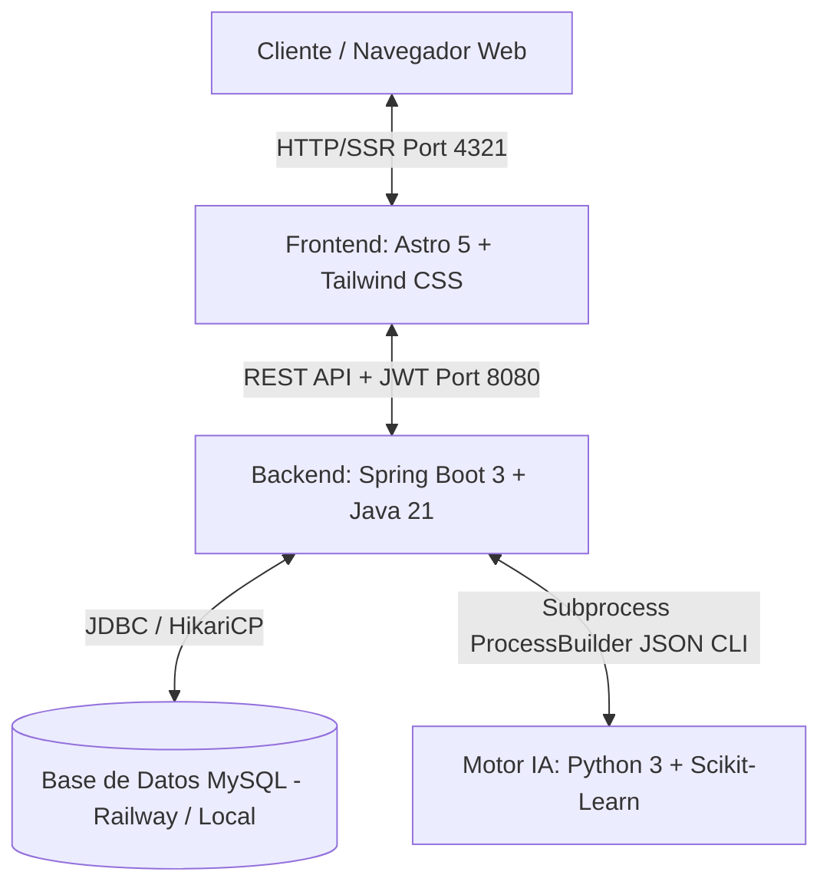
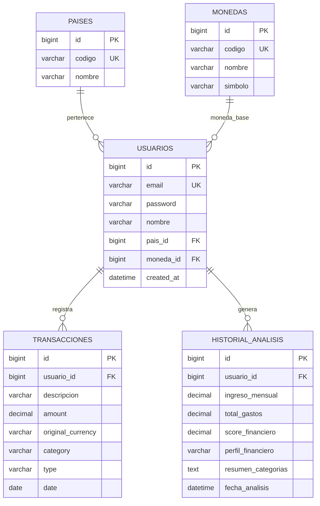
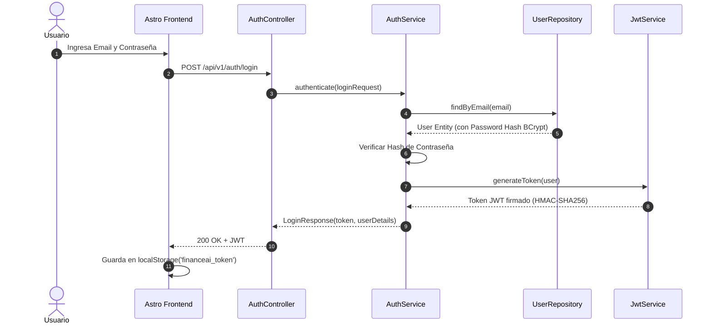
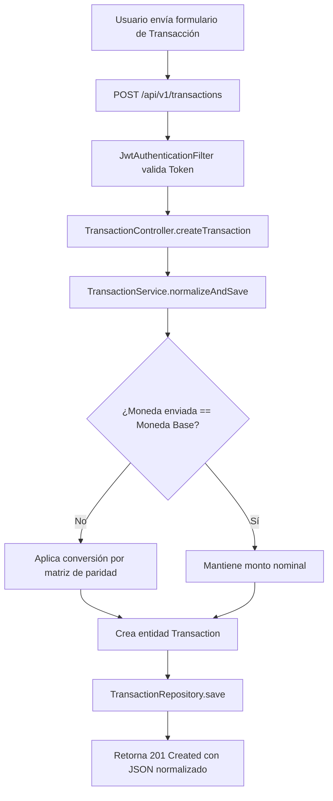
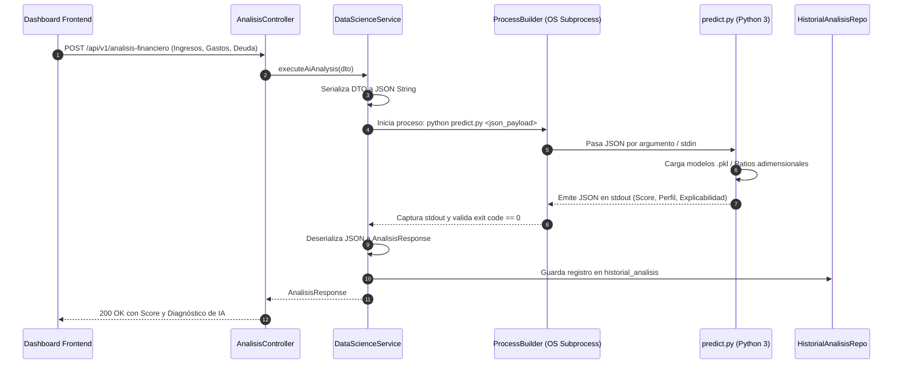
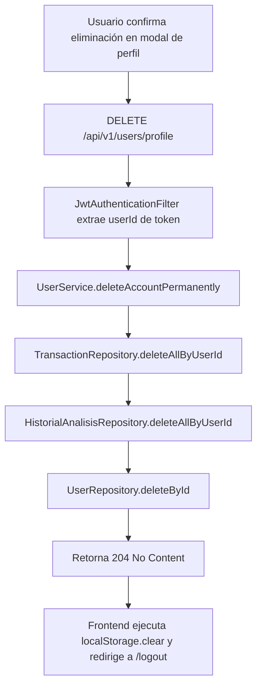

# DOCUMENTACIÓN DEFINITIVA DEL SISTEMA — FINANCEAI
> **Plataforma Integral de Salud Financiera con Inteligencia Artificial, Arquitectura Multi-Moneda y Monitoreo en Tiempo Real.**  
> *Versión Oficial Consolidada — G9-LATAM-Team-77*

---

## TABLA DE CONTENIDOS GENERAL

1. [Visión General y Arquitectura del Sistema](#1-visión-general-y-arquitectura-del-sistema)
2. [Módulo de Data Science & Machine Learning](#2-módulo-de-data-science--machine-learning)
   - [2.1 Formulación Matemática de Ratios Adimensionales](#21-formulación-matemática-de-ratios-adimensionales)
   - [2.2 Neutralidad Multidivisa en IA](#22-neutralidad-multidivisa-en-ia)
   - [2.3 Pipeline de Entrenamiento y Modelos](#23-pipeline-de-entrenamiento-y-modelos)
   - [2.4 Protocolo CLI de Inferencia Subprocess](#24-protocolo-cli-de-inferencia-subprocess)
   - [2.5 Matriz Heurística de Respaldo y Tolerancia a Fallos](#25-matriz-heurística-de-respaldo-y-tolerancia-a-fallos)
3. [Módulo Backend (Spring Boot 3 & Java 21)](#3-módulo-backend-spring-boot-3--java-21)
   - [3.1 Tabla de Clases y Responsabilidades](#31-tabla-de-clases-y-responsabilidades)
   - [3.2 Esquema de Base de Datos y Entidades JPA](#32-esquema-de-base-de-datos-y-entidades-jpa)
   - [3.3 Catálogo Completo de Endpoints REST](#33-catálogo-completo-de-endpoints-rest)
   - [3.4 Diagramas de Flujo del Sistema (Mermaid)](#34-diagramas-de-flujo-del-sistema-mermaid)
4. [Módulo Frontend (Astro 5 & Tailwind CSS)](#4-módulo-frontend-astro-5--tailwind-css)
   - [4.1 Mapa del Sitio y Arquitectura de Rutas](#41-mapa-del-sitio-y-arquitectura-de-rutas)
   - [4.2 Sistema de Diseño, Tipografía y Regla Anti-Emojis](#42-sistema-de-diseño-tipografía-y-regla-anti-emojis)
   - [4.3 Catálogo de Estado y Persistencia (localStorage)](#43-catálogo-de-estado-y-persistencia-localstorage)
   - [4.4 Motor Multidivisa y Tabla Oficial de Equivalencias](#44-motor-multidivisa-y-tabla-oficial-de-equivalencias)
   - [4.5 UX Avanzado: Calendario Glassmorphic y Exportación Excel](#45-ux-avanzado-calendario-glassmorphic-y-exportación-excel)
5. [Guía Maestra: Cómo Levantar Todo el Sistema Paso a Paso (Pro)](#5-guía-maestra-cómo-levantar-todo-el-sistema-paso-a-paso-pro)
   - [5.1 Requisitos Previos](#51-requisitos-previos)
   - [5.2 Paso 1: Configuración de Variables de Entorno](#52-paso-1-configuración-de-variables-de-entorno)
   - [5.3 Paso 2: Inicialización del Entorno Python (Data Science)](#53-paso-2-inicialización-del-entorno-python-data-science)
   - [5.4 Paso 3: Compilación y Ejecución del Backend Spring Boot](#54-paso-3-compilación-y-ejecución-del-backend-spring-boot)
   - [5.5 Paso 4: Ejecución del Frontend Astro](#55-paso-4-ejecución-del-frontend-astro)
   - [5.6 Paso 5: Despliegue con Docker / Docker Compose](#56-paso-5-despliegue-con-docker--docker-compose)
6. [Manejo de Errores Comunes y Preguntas Frecuentes](#6-manejo-de-errores-comunes-y-preguntas-frecuentes)

---

## 1. VISIÓN GENERAL Y ARQUITECTURA DEL SISTEMA

FinanceAI es una solución integral orientada a la salud financiera de usuarios individuales y PyMEs en Latinoamérica. La arquitectura está desacoplada en tres capas principales:



---

## 2. MÓDULO DE DATA SCIENCE & MACHINE LEARNING

Ubicación del código fuente: `C:\Java\G9-LATAM-Team-77\DataScient`

### 2.1 Formulación Matemática de Ratios Adimensionales

El motor de Machine Learning no evalúa magnitudes absolutas en dinero para diagnosticar la salud financiera; en su lugar, transforma los datos financieros en **ratios adimensionales normalizados**:

1. **Ratio de Gasto sobre Ingreso ($R_{GI}$):**
   $$R_{GI} = \frac{\sum \text{Gastos Mensuales}}{\text{Ingreso Mensual}}$$
2. **Tasa de Ahorro Real ($R_{Ahorro}$):**
   $$R_{Ahorro} = \frac{\max(0, \text{Ingreso Mensual} - \sum \text{Gastos})}{\text{Ingreso Mensual}}$$
3. **Ratio de Endeudamiento Mensual ($R_{Deuda}$):**
   $$R_{Deuda} = \frac{\text{Cuotas de Deuda Mensual}}{\text{Ingreso Mensual}}$$
4. **Ponderaciones por Tipo de Gasto:**
   $$\% \text{ Gasto Esencial} = \frac{\text{Gastos Básicos (Vivienda, Comida, Servicios, Transporte)}}{\text{Ingreso Mensual}}$$
   $$\% \text{ Gasto Discrecional} = \frac{\text{Gastos Estilo de Vida (Entretenimiento, Compras, Salidas)}}{\text{Ingreso Mensual}}$$

### 2.2 Neutralidad Multidivisa en IA

Gracias al uso de variables adimensionales, **el modelo de IA es 100% independiente de la divisa**.  
Dado que tanto el numerador como el denominador se expresan en la misma moneda del usuario (`USD`, `MXN`, `EUR`, `CRC`, `COP`, `ARS`, `CLP`, `PEN`), la unidad monetaria se cancela matemáticamente:

$$\text{Ejemplo: } \frac{\$1,500 \text{ USD Gastos}}{\$3,000 \text{ USD Ingresos}} = 0.50 \equiv \frac{\$25,500 \text{ MXN Gastos}}{\$51,000 \text{ MXN Ingresos}} = 0.50$$

El score predictivo y las recomendaciones de ahorro resultantes son idénticos y matemáticamente justos para cualquier país.

### 2.3 Pipeline de Entrenamiento y Modelos

El archivo `src/train_models.py` gestiona el pipeline de aprendizaje supervisado:

1. **Modelo de Clasificación de Transacciones (`transaction_model.pkl`):**
   - **Algoritmo:** `LogisticRegression(max_iter=1000)` precedido por `TfidfVectorizer(max_features=5000)`.
   - **Objetivo:** Clasificar texto libre de transacciones (ej: *"Starbucks reforma"*, *"Uber al trabajo"*) en categorías financieras oficiales (`Alimentación`, `Transporte`, `Vivienda`, `Servicios`, etc.).
   - **Métrica:** Precisión en test $> 95\%$.
2. **Modelo de Perfil Financiero (`profile_model.pkl`):**
   - **Algoritmo:** `RandomForestClassifier(n_estimators=100, random_state=42)`.
   - **Objetivo:** Predecir categoría de riesgo: `Saludable`, `En observación` o `En riesgo`.
   - **Métrica:** Accuracy $> 98\%$ en datos de validación cruzada.

### 2.4 Protocolo CLI de Inferencia Subprocess

El script `src/predict.py` se comunica con el backend Spring Boot vía flujos estándar `stdin` / `stdout` o argumentos `argv`:

- **Payload de Entrada (JSON vía stdin):**
  ```json
  {
    "type": "full_analysis",
    "ingreso_mensual": 3000.0,
    "gastos_mensuales": 1200.0,
    "deuda_total": 450.0,
    "transacciones": [
      { "descripcion": "Supermercado Walmart", "valor": 350.0 },
      { "descripcion": "Renta departamento", "valor": 600.0 }
    ]
  }
  ```
- **Payload de Salida (JSON vía stdout):**
  ```json
  {
    "status": "success",
    "score_financiero": 85.0,
    "perfil_financiero": "Saludable",
    "explicabilidad_ds08": {
      "diagnostico": "Tu salud financiera está en nivel Saludable (Score 85/100).",
      "causa_principal": "Factor determinante: tu nivel de endeudamiento está por debajo del 15%.",
      "accion_recomendada": "Mantén tu fondo de ahorro mensual e invierte excedentes."
    },
    "recomendaciones": [
      "Felicidades por mantener un gasto menor al 50% de tus ingresos.",
      "Destina un 10% adicional a inversión diversificada."
    ]
  }
  ```

### 2.5 Matriz Heurística de Respaldo y Tolerancia a Fallos

Si el archivo `.pkl` no se encuentra o el proceso sufre alguna excepción por datos extremos:
- El sistema activa un **motor de reglas determinísticas (Fallback Heurístico)** basado en la regla clásica `50-30-20`.
- Control de división por cero: Si el ingreso mensual es `$0`, se asigna automáticamente una penalización estructurada sin provocar caídas del proceso.

---

## 3. MÓDULO BACKEND (SPRING BOOT 3 & JAVA 21)

Ubicación del código fuente: `C:\Java\G9-LATAM-Team-77\Backend\financeia-backend`

### 3.1 Tabla de Clases y Responsabilidades

| Clase | Paquete | Rol | Responsabilidad Principal |
| :--- | :--- | :--- | :--- |
| `FinanceiaBackendApplication` | `com.financeia` | Main | Punto de entrada e inicio del contexto Spring Boot. |
| `SecurityConfig` | `config` | Seguridad | Configuración de CORS, CSRF deshabilitado, Stateless Session y filtros JWT. |
| `JwtAuthenticationFilter` | `config` | Filtro HTTP | Intercepta cada petición, extrae `Bearer <token>`, valida firma y establece el `SecurityContext`. |
| `AuthController` | `controllers` | REST Controller | Autenticación (`/login`, `/register`, `/google-sync`, `/reset-password`). |
| `AnalisisController` | `controllers` | REST Controller | Inicia análisis de salud financiera con la IA (`/analisis-financiero`). |
| `DashboardController` | `controllers` | REST Controller | Agregación de KPIs, gastos por categoría y series temporales (`/dashboard`). |
| `TransactionController` | `controllers` | REST Controller | CRUD de transacciones financieras y normalización de montos (`/transactions`). |
| `UserController` | `controllers` | REST Controller | Gestión de perfil, moneda base y eliminación en cascada (`/users/profile`). |
| `HealthController` | `controllers` | REST Controller | Endpoint de disponibilidad y monitoreo del backend (`/health`). |
| `DataScienceService` | `service` | Integración IA | Ejecuta `ProcessBuilder` invocando `predict.py` y mapea respuestas a entidades. |
| `TransactionService` | `service` | Lógica Negocio | Persistencia, clasificación de flujos y cálculos de totales acumulados. |
| `AuthService` | `service` | Lógica Negocio | Registro con encriptación BCrypt y autenticación de credenciales. |
| `JwtService` | `service` | Criptografía | Generación, expiración y firma HMAC-SHA256 de tokens JWT. |
| `UserService` | `service` | Lógica Negocio | Actualizaciones de perfil y borrado atómico total de registros (`DELETE`). |
| `UserRepository` | `repository` | JPA Data Access | Interfaz de acceso a la tabla `usuarios`. |
| `TransactionRepository` | `repository` | JPA Data Access | Interfaz de acceso a la tabla `transacciones`. |
| `HistorialAnalisisRepository` | `repository` | JPA Data Access | Interfaz de acceso a la tabla `historial_analisis`. |
| `GlobalExceptionHandler` | `exception` | Manejador Errores | Captura de excepciones globales y respuestas con formato RFC 7807. |

### 3.2 Esquema de Base de Datos y Entidades JPA



### 3.3 Catálogo Completo de Endpoints REST

| Método | URL | Descripción | Autenticación | Request Body | Códigos de Respuesta |
| :--- | :--- | :--- | :---: | :--- | :--- |
| `POST` | `/api/v1/auth/register` | Registro de nuevo usuario | Pública | `{"email", "password", "nombre"}` | `201 Created`, `400 Bad Request` |
| `POST` | `/api/v1/auth/login` | Login con email y contraseña | Pública | `{"email", "password"}` | `200 OK` (con JWT), `401 Unauthorized` |
| `POST` | `/api/v1/auth/google-sync` | Sincronización de sesión OAuth2 Google | Pública | `{"email", "name", "googleId"}` | `200 OK` (con JWT) |
| `POST` | `/api/v1/auth/reset-password` | Solicitud de restablecimiento | Pública | `{"email"}` | `200 OK` |
| `GET` | `/api/v1/users/profile` | Obtiene el perfil del usuario autenticado | `Bearer JWT` | Ninguno | `200 OK` |
| `PUT` | `/api/v1/users/profile` | Actualiza moneda base y país del usuario | `Bearer JWT` | `{"paisId", "monedaId"}` | `200 OK` |
| `DELETE`| `/api/v1/users/profile` | **Elimina la cuenta y todos sus datos en cascada** | `Bearer JWT` | Ninguno | `204 No Content` |
| `GET` | `/api/v1/transactions` | Lista todas las transacciones del usuario | `Bearer JWT` | Ninguno (Query params opcionales) | `200 OK` |
| `POST` | `/api/v1/transactions` | Crea una nueva transacción | `Bearer JWT` | `{"description", "amount", "category", "type", "date"}` | `201 Created` |
| `GET` | `/api/v1/dashboard/summary` | Obtiene resumen consolidado para el Dashboard | `Bearer JWT` | Ninguno | `200 OK` |
| `GET` | `/api/v1/dashboard/history` | Obtiene series temporales para gráficas | `Bearer JWT` | Ninguno | `200 OK` |
| `POST` | `/api/v1/analisis-financiero` | **Ejecuta el análisis de IA (Bridge a Python)** | `Bearer JWT` | `{"ingresoMensual", "deudaTotal", ...}` | `200 OK` (Score + Diagnóstico) |
| `GET` | `/api/v1/health` | Health Check de liveness y readiness | Pública | Ninguno | `200 OK` (`{"status": "UP"}`) |

### 3.4 Diagramas de Flujo del Sistema (Mermaid)

#### Flujo 1: Registro y Autenticación con Emisión de Token JWT


#### Flujo 2: Ingesta de Transacciones y Normalización de Divisas


#### Flujo 3: Ejecución del Puente de Inferencia IA (Spring Boot ➔ Python CLI)


#### Flujo 4: Eliminación Total de Cuenta en Cascada (*Danger Zone*)


---

## 4. MÓDULO FRONTEND (ASTRO 5 & TAILWIND CSS)

Ubicación del código fuente: `C:\Java\G9-LATAM-Team-77\Frontend`

### 4.1 Mapa del Sitio y Arquitectura de Rutas

| Ruta | Archivo Astro | Tipo de Renderizado | Guardias de Acceso | Propósito |
| :--- | :--- | :---: | :---: | :--- |
| `/` | `index.astro` | SSR / Redirige | Condicional | Redirecciona a `/dashboard` si hay token, de lo contrario a `/login`. |
| `/login` | `login.astro` | SSR / Client Hydration | Público | Inicio de sesión, registro interactivo, OAuth2 Google y recuperación. |
| `/dashboard` | `dashboard.astro` | SSR + Client Scripts | **Protegido (Token)** | Registro de movimientos (diario/semanal/mensual), velocímetro de Score y análisis de IA. |
| `/historial` | `historial.astro` | SSR + Client Scripts | **Protegido (Token)** | Visualización temporal con picos, filtros de mes/rango, conversor de divisas y exportación Excel. |
| `/logout` | `logout.astro` | SSR | Público | Pantalla de cierre de sesión centrada con fondo difuminado y confirmación. |

### 4.2 Sistema de Diseño, Tipografía y Regla Anti-Emojis

- **Tipografía Oficial:**
  - **Titulares, Logotipo y Badges:** `Josefin Sans` (elegante, geométrica y moderna).
  - **Métricas, Tablas, Formularios y Datos:** `Inter` (alta legibilidad técnica).
- **Esquema de Color Dual (Light / Dark Mode):**
  - *Modo Claro:* Fondos `bg-gray-50`, tarjetas `bg-white`, bordes `border-gray-200`, textos `text-gray-900`.
  - *Modo Oscuro:* Fondos `dark:bg-gray-950`, tarjetas `dark:bg-gray-900`, bordes `dark:border-gray-800`, textos `dark:text-white`.
- **Regla Estricta Anti-Emojis:**
  - Se prohíbe el uso de emojis crudos en la interfaz de usuario.
  - Toda la iconografía utiliza **vectores SVG limpios** (escalables y estilizados).
  - Los formularios incluyen validación regex (`EMOJI_REGEX`) para impedir caracteres emoji en descripciones.

### 4.3 Catálogo de Estado y Persistencia (`localStorage`)

| Clave en LocalStorage | Tipo | Descripción |
| :--- | :---: | :--- |
| `financeai_token` | `string` | Token JWT de sesión activa para cabeceras HTTP `Authorization: Bearer`. |
| `financeai_user` | `JSON Object` | Datos del usuario logueado (nombre, email, avatar). |
| `financeai_preferred_currency` | `string` | Moneda base seleccionada en perfil (`USD`, `MXN`, `EUR`, `CRC`, etc.). |
| `financeai_all_transactions` | `JSON Array` | Lista acumulativa de transacciones para consulta histórica inmediata. |
| `financeai_dashboard_txns` | `JSON Array` | Transacciones del período activo en el Dashboard. |
| `financeai_history_cleared` | `boolean` | Bandera que indica si el usuario borró deliberadamente su historial. |
| `financeai_avatar` | `string` | URL del avatar seleccionado entre las 9 opciones predefinidas. |
| `theme` | `string` | Tema activo del usuario (`light` o `dark`). |

### 4.4 Motor Multidivisa y Tabla Oficial de Equivalencias

El sistema incorpora la **matriz oficial de paridad de divisas base USD**:

| Moneda | Código | Símbolo | Equivalencia Oficial en USD | Tipo de Cambio Calculado |
| :--- | :---: | :---: | :---: | :--- |
| **Dólar estadounidense** | `USD` | `$` | **$1.00** | 1 USD = $1.00 USD |
| **Peso mexicano** | `MXN` | `$` | **$0.0591** | 1 USD = $16.92 MXN |
| **Euro** | `EUR` | `€` | **$1.1687** | 1 USD = €0.8557 EUR |
| **Colón costarricense** | `CRC` | `₡` | **$0.0022** | 1 USD = ₡454.55 CRC |
| **Peso colombiano** | `COP` | `$` | **$0.000326** | 1 USD = $3,067.48 COP |
| **Peso argentino** | `ARS` | `$` | **$0.000667** | 1 USD = $1,499.25 ARS |
| **Peso chileno** | `CLP` | `$` | **$0.001093** | 1 USD = $914.91 CLP |
| **Sol peruano** | `PEN` | `S/` | **$0.2982** | 1 USD = S/ 3.35 PEN |

**Fórmula de Conversión Dinámica:**
$$\text{Monto en Moneda Destino} = \frac{\text{Monto en Moneda Origen} \times \text{Valor en USD Origen}}{\text{Valor en USD Destino}}$$

Al hacer clic en cualquier botón de moneda en el Historial (`EUR`, `MXN`, `USD`, `CRC`, etc.), la conversión se propaga **en tiempo real sin recargar la página** sobre:
1. Tarjetas KPI de Totales y Balance.
2. Gráfica de Fluctuaciones y Picos de Chart.js (incluyendo escalas del eje Y y leyendas).
3. Gráfico Donut de Distribución por Categorías.
4. Tabla de Movimientos Registrados.

### 4.5 UX Avanzado: Calendario Glassmorphic y Exportación Excel

1. **Selector de Mes Personalizado Glassmorphic:**
   - Permite seleccionar cualquier mes individual o rango personalizado de fechas.
   - **Reglas de Negocio:** No permite seleccionar fechas posteriores a la fecha actual del sistema, y limita la búsqueda a un máximo de **2 años atrás (24 meses)**.
2. **Exportación Ejecutiva a Excel (`.CSV`):**
   - Incorpora cabecera con metadatos de emisión y moneda seleccionada.
   - Incluye bloque de Resumen Financiero Ejecutivo (Ingresos, Gastos, Balance).
   - Incluye tabla de Desglose de Gastos por Categoría con porcentajes.
   - Incluye tabla completa de movimientos detallados.
   - Cuenta con codificación **UTF-8 BOM (`\uFEFF`)** para apertura directa en Microsoft Excel en Windows y macOS con acentuación y símbolos correctos.

---

## 5. GUÍA MAESTRA: CÓMO LEVANTAR TODO EL SISTEMA PASO A PASO (PRO)

Esta sección está diseñada para que cualquier persona ajena al proyecto pueda clonar, configurar y ejecutar todo el ecosistema de FinanceAI de manera rápida y sin complicaciones.

### 5.1 Requisitos Previos

Asegúrate de tener instaladas las siguientes herramientas en tu máquina:
- **Java Development Kit (JDK) 21** o superior.
- **Apache Maven 3.8+** (o el wrapper `mvnw` incluido).
- **Python 3.10+** (con `pip`).
- **Node.js 18.0.0+** (recomendado Node 20 LTS o 22 LTS).
- **Git**.
- **Docker Desktop** (opcional, si se prefiere ejecución en contenedores).

---

### 5.2 Paso 1: Configuración de Variables de Entorno

En la raíz del proyecto (`C:\Java\G9-LATAM-Team-77`), crea o edita el archivo `.env`:

```env
# Configuración de Base de Datos MySQL (Railway o Local)
MYSQLUSER=root
MYSQL_ROOT_PASSWORD=tu_password_mysql
MYSQLHOST=sakura.proxy.rlwy.net
MYSQLPORT=32819
MYSQLDATABASE=railway

# Seguridad JWT
JWT_SECRET=super_secret_jwt_key_financeai_latam_team_77_enterprise_2026

# Rutas de Data Science
PYTHON_COMMAND=python
DATA_SCIENCE_SCRIPT=../../DataScient/src/predict.py

# URL del Backend para el Frontend
PUBLIC_API_URL=http://localhost:8080
```

---

### 5.3 Paso 2: Inicialización del Entorno Python (Data Science)

1. Abre una terminal y dirígete a la carpeta `DataScient`:
   ```bash
   cd C:\Java\G9-LATAM-Team-77\DataScient
   ```
2. Crea y activa el entorno virtual:
   - **En Windows (PowerShell / CMD):**
     ```powershell
     python -m venv venv
     .\venv\Scripts\activate
     ```
   - **En Linux / macOS:**
     ```bash
     python3 -m venv venv
     source venv/bin/activate
     ```
3. Instala las dependencias necesarias:
   ```bash
   pip install -r requirements.txt
   ```
4. Entrena y genera los modelos `.pkl`:
   ```bash
   python src/train_models.py
   ```
   *(Verificarás que se imprima la precisión del modelo y se guarden `transaction_model.pkl` y `profile_model.pkl` en `models/`)*.
5. Prueba una inferencia rápida:
   ```bash
   echo {"type": "transaction", "descripcion": "supermercado walmart"} | python src/predict.py
   ```

---

### 5.4 Paso 3: Compilación y Ejecución del Backend Spring Boot

1. Abre una nueva terminal y dirígete al directorio del Backend:
   ```bash
   cd C:\Java\G9-LATAM-Team-77\Backend\financeia-backend
   ```
2. Compila el proyecto con Maven:
   ```bash
   mvn clean install -DskipTests
   ```
3. Inicia el servidor Spring Boot:
   ```bash
   mvn spring-boot:run
   ```
4. **Verificación:**
   - El backend estará escuchando en `http://localhost:8080`.
   - Puedes verificar su estado abriendo en tu navegador: `http://localhost:8080/api/v1/health` (debe responder `{"status":"UP"}`).
   - Documentación Swagger interactiva: `http://localhost:8080/swagger-ui.html`.

---

### 5.5 Paso 4: Ejecución del Frontend Astro

1. Abre una tercera terminal y dirígete al directorio del Frontend:
   ```bash
   cd C:\Java\G9-LATAM-Team-77\Frontend
   ```
2. Instala los módulos de Node.js:
   ```bash
   npm install
   ```
3. Inicia el servidor de desarrollo de Astro:
   ```bash
   npm run dev
   ```
4. **Acceso a la Aplicación:**
   - Abre tu navegador web en `http://localhost:4321`.
   - Regístrate con un nuevo usuario o inicia sesión para acceder al Dashboard y al Historial con IA.

---

### 5.6 Paso 5: Despliegue con Docker / Docker Compose

Si prefieres levantar todo el ecosistema con un solo comando utilizando Docker:

1. Asegúrate de tener **Docker Desktop** iniciado.
2. En la raíz del proyecto (`C:\Java\G9-LATAM-Team-77`), ejecuta:
   ```bash
   docker-compose up --build
   ```
3. Docker orquestará los contenedores del Backend (con Python integrado) y del Frontend Astro automáticamente.

---

## 6. MANEJO DE ERRORES COMUNES Y PREGUNTAS FRECUENTES

| Síntoma / Error | Causa Probable | Solución Recomendada |
| :--- | :--- | :--- |
| `java.io.IOException: Cannot run program "python"` | El ejecutable de Python no está en el PATH del sistema. | Configura la variable `PYTHON_COMMAND=python3` o la ruta absoluta a `venv/Scripts/python.exe` en `application.properties` o `.env`. |
| `CommunicationsException: Communications link failure` | No hay conexión con la base de datos MySQL en Railway. | Verifica tu conexión a internet o comprueba las credenciales de host y puerto en `.env`. |
| `CORS error` al hacer peticiones desde el navegador | El frontend se ejecuta en un puerto diferente al configurado en el backend. | Asegúrate de que `SecurityConfig.java` tenga permitido el origen `http://localhost:4321` y `http://localhost:3000`. |
| Error `ZeroDivisionError` en predicciones de IA | El usuario ingresó `$0` de ingresos en el análisis. | El script `predict.py` cuenta con validación defensiva integrada; asegúrate de haber corrido `train_models.py` con la última versión de los scripts. |
| Caracteres extraños en Excel al exportar CSV | Falta de codificación UTF-8 con BOM. | Resuelto de fábrica: la función de exportación en `historial.astro` inyecta automáticamente el prefijo `\uFEFF`. |

---