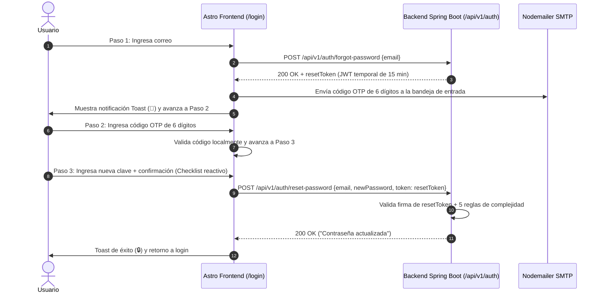

# Documentación Técnica del Frontend — FinanceAI

Documento de arquitectura técnica, mapa de sitio, jerarquía de componentes, políticas de seguridad y manual operativo del cliente web desarrollado con **Astro 5** y **Tailwind CSS**.

---

## 1. Arquitectura de Configuración Centralizada (.env)

El cliente frontend implementa la arquitectura de **archivo `.env` centralizado único** ubicado en la raíz del proyecto (`C:\Java\G9-LATAM-Team-77\.env`).

En `Frontend/astro.config.mjs`, se define:
```javascript
export default defineConfig({
  output: 'server',
  adapter: node({
    mode: 'standalone'
  }),
  vite: {
    envDir: '../', // Carga el archivo .env de la raíz del proyecto
    plugins: [tailwindcss()]
  },
  integrations: [auth()]
});
```

Esto permite que:
- Tanto variables del cliente (`PUBLIC_API_URL`, `SITE_URL`) como del servidor SSR (`AUTH_SECRET`, `GOOGLE_CLIENT_ID`, `GMAIL_PASS`) se gestionen desde un único punto de verdad compartido con el backend Spring Boot 3 (Java 17 LTS).

---

## 2. Mapa de Sitio y Arquitectura de Rutas

| Ruta | Archivo Astro | Tipo de Renderizado | Guardias de Acceso | Propósito | Componentes Clave |
| :--- | :--- | :---: | :---: | :--- | :--- |
| `/` | `index.astro` | SSR / Redirección | Condicional | Punto de entrada. Redirige a `/dashboard` si hay sesión o a `/login`. | `Layout` |
| `/login` | `login.astro` | SSR + Hidratación Cliente | Público | Autenticación de usuario: Login, Registro con consentimiento LFPDPPP, Google OAuth2 y Recuperación de contraseña en 3 pasos. | `Layout`, Formularios de Auth, Modales de Recuperación |
| `/dashboard` | `dashboard.astro` | SSR + Scripts de Cliente | Protegido (Token JWT) | Captura de ingresos/gastos (diario, semanal, mensual), cálculo de salud financiera con IA explicable (XAI) y disclaimer financiero. | `Layout`, Velocímetro de Score, Tarjetas KPI, Formulario de Movimientos |
| `/historial` | `historial.astro` | SSR + Scripts de Cliente | Protegido (Token JWT) | Visualización analítica histórica, gráfica multi-línea con picos, selector de mes y conversor multidivisa en tiempo real. | `Layout`, Gráfica de Línea Chart.js, Donut Chart, Tabla de Transacciones, Modal de Borrado |
| `/terminos` | `terminos.astro` | SSR Estático | Público | Términos y Condiciones Generales de Uso, delimitación Ley Fintech, gobernanza de IA y Google OAuth2. | `Layout`, Contenido Legal, Botón Imprimir PDF |
| `/privacidad` | `privacidad.astro` | SSR Estático | Público | Aviso de Privacidad Integral conforme a LFPDPPP (INAI), GDPR, CCPA (Do Not Sell) y Google API Policy. | `Layout`, Contenido Legal, Botón Imprimir PDF |
| `/logout` | `logout.astro` | SSR | Público | Pantalla de confirmación y cierre seguro de sesión con difuminado de fondo. | `Layout`, Modal Centrado de Logout |

---

## 3. Sistema de Diseño y Tipografía

### Tipografía
- **Titulares, Logotipo y Etiquetas:** `Josefin Sans` (geométrica, moderna y corporativa).
- **Métricas, Tablas, Formularios y Datos:** `Inter` (alta legibilidad y neutralidad).

### Esquema de Color Dual (Modo Claro y Oscuro)
Configurado a través de clases utilitarias de Tailwind CSS y selector de tema persistente:
- **Modo Claro:**
  - Fondo de página: `bg-gray-50`
  - Tarjetas y paneles: `bg-white`
  - Bordes: `border-gray-200`
  - Textos principales: `text-gray-900`
  - Textos secundarios: `text-gray-500`
- **Modo Oscuro:**
  - Fondo de página: `dark:bg-gray-950`
  - Tarjetas y paneles: `dark:bg-gray-900`
  - Bordes: `dark:border-gray-800`
  - Textos principales: `dark:text-white`
  - Textos secundarios: `dark:text-gray-400`
- **Colores Semánticos de Estado:**
  - Primario / Acción: `blue-600` (`#2563eb`)
  - Éxito / Ingresos / Ahorro: `emerald-600` (`#059669`)
  - Alerta / Advertencia: `amber-500` (`#f59e0b`)
  - Peligro / Gastos / Deuda: `rose-600` (`#e11d48`) o `red-600` (`#dc2626`)

### Regla Estricta de Iconografía SVG y Bloqueo de Emojis en Formularios
- **Estructura 100% Vectorial SVG:** La interfaz visual y componentes de diseño prescinden totalmente de emojis crudos, empleando vectores SVG limpios, escalables y adaptables a modo claro/oscuro.
- **Higiene Estricta de Credenciales:** Los campos de texto en registro, login y reseteo cuentan con validación de expresiones regulares (`EMOJI_REGEX = /(\p{Extended_Pictographic}|\p{Emoji_Presentation})/u`) que bloquea totalmente emojis en nombres, apellidos, emails y contraseñas.

---

## 4. Política de Alta Seguridad en Contraseñas

La plataforma exige una estricta política de contraseñas tanto en la vista de **Registro** como en el **Paso 3 de Recuperación de Contraseña**:

### Las 6 Reglas de Seguridad Obligatorias:
1. **Mínimo 8 caracteres**
2. **Al menos una letra mayúscula (`[A-Z]`)**
3. **Al menos una letra minúscula (`[a-z]`)**
4. **Al menos un número (`[0-9]`)**
5. **Al menos un carácter especial (`[!@#$%^&*()_+\-=\[\]{};':"\\|,.<>\/?~`]`)**
6. **Confirmación estricta de contraseña y bloqueo total de emojis en credenciales**

### Checklist Visual Interactivo en Tiempo Real con Vectores SVG
- Implementado mediante listeners reactivos en el evento `input`.
- Cada una de las reglas se evalúa dinámicamente:
  - **Estado Incompleto:** Ícono circular neutro SVG en gris tenue (`text-gray-500 dark:text-gray-400`).
  - **Estado Cumplido:** Conmuta a un checkmark SVG verde esmeralda (`text-emerald-600 dark:text-emerald-400`).
- Se bloquea la sumisión del formulario si no se satisfacen el 100% de las reglas o si la confirmación no es idéntica.
- Adicionalmente, el backend Spring Boot 3 valida de forma redundante las 5 reglas en `AuthService.validatePasswordStrength`.

---

## 5. Flujo de Notificaciones Toast Dinámicas con Emojis

A diferencia de los campos de texto e iconografía estructural (100% libres de emojis), el sistema expone un **servicio de Toast notifications reactivas y dinámicas** (`window.showToast(title, message, icon)` en `Layout.astro` y componentes) enriquecidas con emojis semánticos que brindan una experiencia de usuario gratificante y comunicativa:

```javascript
window.showToast = function(title, message, icon = "🔔") {
    // Renderizado en esquina superior derecha con efecto glassmorphism
};
```

### Catálogo Oficial de Emojis en Toasts:

| Emoji | Significado / Contexto | Vista / Componente | Acción Desencadenante |
| :---: | :--- | :--- | :--- |
| 👋 | **Bienvenida** | `/login` | Login exitoso del usuario. |
| 🎉 | **Cuenta Verificada** | `/login` | Activación de cuenta tras ingresar el código OTP de 6 dígitos. |
| 📧 | **Código de Registro Enviado** | `/login` | Notificación de envío del código de seguridad por correo. |
| 📩 | **Código de Recuperación Enviado** | `/login` | Despacho de OTP + emisión de token temporal de 15 min. |
| 💱 | **Conversión Multidivisa** | `/historial` | Cambio reactivo de divisa de visualización en caliente. |
| 📊 | **Vista Histórica Completa** | `/historial` | Activación de filtro para ver todas las transacciones consolidadas. |
| 💾 | **Guardado de Preferencias** | `Header.astro` | Persistencia en backend de la moneda base y avatar de usuario. |
| 📥 | **Reporte Excel Descargado** | `/historial` | Exportación exitosa de archivo `.csv` con UTF-8 BOM. |
| 🔒 | **Contraseña Actualizada** | `/login` | Confirmación de nueva clave en base de datos. |
| ⚠️ | **Advertencia / Validación** | Global | Validación de requisitos incompletos o alerta de borrado. |
| ❌ | **Error de Operación** | Global | Credenciales erróneas o código de verificación inválido. |
| 📡 | **Error de Conexión** | Global | Fallo al comunicarse con el servidor backend (`PUBLIC_API_URL`). |
| 🗑️ | **Historial Eliminado** | `/historial` | Vaciado total de los movimientos registrados. |

---

## 6. Flujo de Recuperación de Contraseña en 3 Pasos (con Token Temporal JWT)

El frontend orquesta un proceso seguro y guiado de recuperación:



---

## 7. Catálogo de Estado y Almacenamiento Local (localStorage)

| Clave | Tipo de Dato | Propósito y Descripción |
| :--- | :---: | :--- |
| `financeai_token` | `string` | Token JWT emitido por el backend para autorización de peticiones en cabecera `Authorization: Bearer <token>`. |
| `financeai_user` | `JSON Object` | Datos de perfil del usuario en sesión (nombre, correo electrónico, identificador). |
| `financeai_preferred_currency` | `string` | Código de la divisa base configurada en el perfil del usuario (ejemplo: `USD`, `MXN`, `EUR`, `CRC`). |
| `financeai_all_transactions` | `JSON Array` | Historial acumulado completo de transacciones para renderizado instantáneo y filtros. |
| `financeai_dashboard_txns` | `JSON Array` | Transacciones activas del período en curso cargadas en el Dashboard. |
| `financeai_history_cleared` | `boolean` | Indicador de borrado intencional de historial por parte del usuario. |
| `financeai_avatar` | `string` | URL del avatar seleccionado de la cuadrícula de 9 avatares predeterminados. |
| `theme` | `string` | Modo de visualización seleccionado (`light` o `dark`). |

---

## 8. Motor Multidivisa y Conversión en Tiempo Real

### Matriz Oficial de Paridad (Base USD)

| Moneda | Código | Símbolo | Equivalencia en USD (1 Unidad) | Tipo de Cambio Calculado |
| :--- | :---: | :---: | :---: | :--- |
| Dólar estadounidense | `USD` | `$` | `$1.00` | 1 USD = $1.00 USD |
| Peso mexicano | `MXN` | `$` | `$0.0591` | 1 USD = $16.92 MXN |
| Euro | `EUR` | `€` | `$1.1687` | 1 USD = €0.8557 EUR |
| Colón costarricense | `CRC` | `₡` | `$0.0022` | 1 USD = ₡454.55 CRC |
| Peso colombiano | `COP` | `$` | `$0.000326` | 1 USD = $3,067.48 COP |
| Peso argentino | `ARS` | `$` | `$0.000667` | 1 USD = $1,499.25 ARS |
| Peso chileno | `CLP` | `$` | `$0.001093` | 1 USD = $914.91 CLP |
| Sol peruano | `PEN` | `S/` | `$0.2982` | 1 USD = S/ 3.35 PEN |

### Mecanismo de Conversión Reactiva
La función `convertAmount(amount, fromCur, toCur)` en `historial.astro` y `currency.ts` aplica la conversión matemática en memoria sin realizar peticiones bloqueantes de red:
$$\text{Monto Destino} = \frac{\text{Monto Origen} \times \text{Valor en USD de Moneda Origen}}{\text{Valor en USD de Moneda Destino}}$$

Al interactuar con los botones de divisa en la vista de Historial:
1. Se recalculan y formatean las tarjetas KPI de Ingresos, Gastos y Balance Neto.
2. Se actualizan las series de datos, etiquetas y escalas del eje Y de la gráfica multi-línea.
3. Se actualizan las cantidades en la leyenda del gráfico de dona.
4. Se convierten los valores individuales de cada fila en la tabla de movimientos.

---

## 9. Guía de Ejecución y Compilación del Frontend

### Requisitos
- **Node.js:** Versión 18.0.0 o superior (recomendado Node 20 LTS o 22 LTS).
- **Gestor de paquetes:** `npm` o `pnpm`.
- **Archivo `.env`:** Configurado en la raíz del repositorio (`C:\Java\G9-LATAM-Team-77\.env`).

### Comandos de Desarrollo
```bash
# 1. Instalar dependencias
cd Frontend
npm install

# 2. Iniciar servidor de desarrollo en puerto 4321
npm run dev

# 3. Compilar para producción (Standalone Node Adapter)
npm run build

# 4. Iniciar servidor compilado
node ./dist/server/entry.mjs
```

---

## 10. Cumplimiento Legal, Privacidad y Derechos ARCO en el Frontend

El frontend implementa los siguientes componentes y flujos para garantizar la máxima transparencia y cumplimiento normativo:

### 10.1 Páginas Legales Públicas Dedicadas
- **`/terminos` (`terminos.astro`):** Términos de Servicio oficiales con delimitación ante la Ley Fintech (sin captación de fondos), deslinde de asesoría de inversiones, declaración de autenticación con Google bajo Requisitos de Uso Limitado y botón para exportar o imprimir en PDF.
- **`/privacidad` (`privacidad.astro`):** Aviso de Privacidad Integral conforme a la LFPDPPP (INAI), GDPR y CCPA con garantía expresa *"Do Not Sell or Share My Personal Information"*.

### 10.2 Componentes Globales de Cumplimiento
- **Footer Institucional (`Layout.astro`):** Enlaces directos a Términos, Privacidad, botón emergente de *No Venta de Datos* y *Transparencia de IA*, junto con badges de seguridad `SSL 256-Bit` e `IA Auditada`.
- **Modal Glassmorphic Universal (`#globalLegalModal`):** Permite abrir y consultar cualquier cláusula legal desde cualquier vista sin abandonar el flujo de trabajo actual.
- **Consentimiento en Registro (`login.astro`):** Checkbox obligatorio no premarcado que valida el consentimiento expreso para el tratamiento de datos patrimoniales conforme al Art. 8 de la LFPDPPP.
- **Gestión de Derechos ARCO en Perfil (`Header.astro`):**
  - *Acceso:* Botón para generar y descargar inmediatamente el archivo `expediente_datos_financeai_[TIMESTAMP].json`.
  - *Rectificación:* Acceso guiado para modificación de moneda base y perfil.
  - *Oposición:* Switch interactivo con persistencia local para limitar el uso de datos en estadísticas globales.
  - *Cancelación:* Enlace directo a la Zona de Peligro para eliminación permanente e irreversible de la cuenta en MySQL.
- **Explicabilidad y Descargo Financiero (`dashboard.astro`):** Badge oficial `Motor DS-08: IA Explicable (XAI)` y banner institucional de descargo de responsabilidad financiera.

