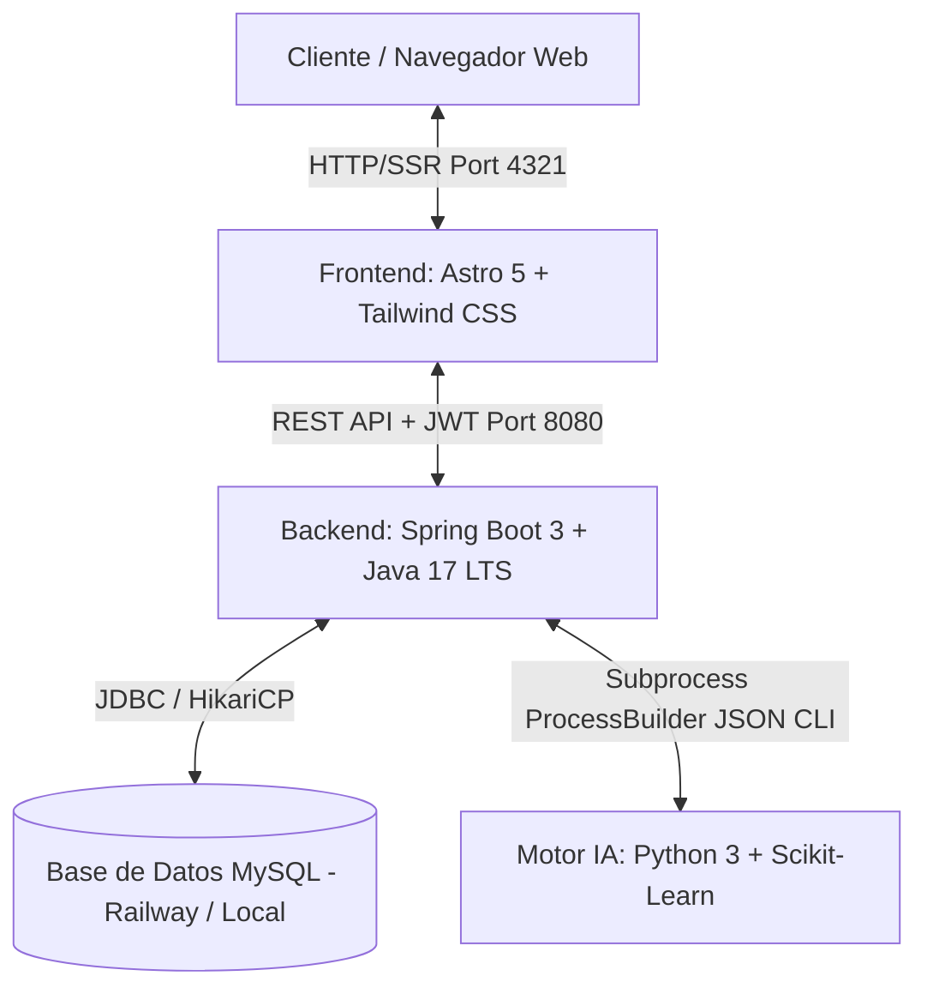
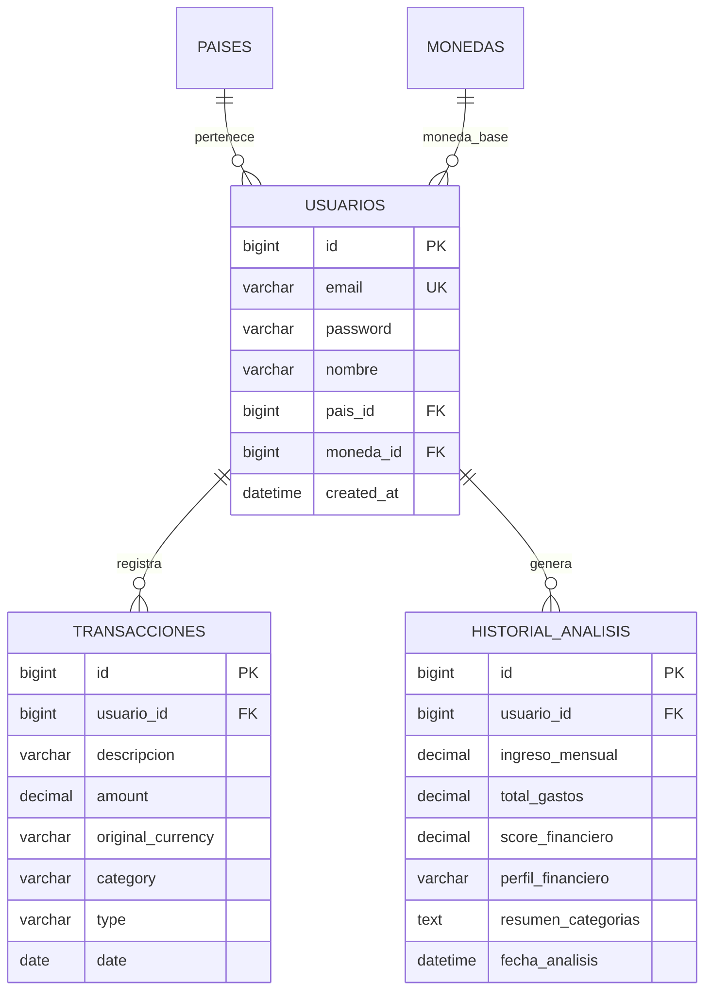

# 📊 FinanceAI - Asistente Inteligente de Salud Financiera


> **Nota:** Este repositorio contiene la Versión Corporativa Oficial Extendida y Definitiva de **FinanceAI**. La arquitectura, los modelos de Machine Learning, la API REST y la interfaz de usuario se encuentran totalmente implementados e integrados en un entorno cloud.

## 👥 Equipo de Desarrollo (G9-LATAM-Team-77)
- **Luisa Fernanda Bedoya** - Data Scientist
- **Edmar Mario Urquiza Quispe** - Data Scientist
- **Giselle Jacqueline Morales de la Cruz** - Data Scientist
- **Kevin Aron Sumire Ccahuana** - Data Scientist
- **Fernando Jose Reynosa Vidal** - Backend Developer
- **Justin Alejandro Aguirre Navarro** - Backend Developer
- **Irwing Jonathan Ramirez Paz** - Backend Developer

## 🎯 El Desafío
En la actualidad, el mercado de fintechs, bancos digitales y plataformas de educación financiera está en constante expansión. Muchas personas tienen acceso a los datos brutos de sus transacciones, pero **tienen gran dificultad para transformar esa información en conocimiento útil** para la toma de decisiones. Existe una marcada dificultad técnica y cognitiva para entender hábitos financieros, categorizar flujos de caja y diagnosticar el nivel de sobreendeudamiento, lo cual fomenta el estrés financiero y reduce la capacidad de ahorro.

## 💡 Nuestro Objetivo
**FinanceAI** nace como una solución inteligente orientada a usuarios de carteras digitales e instituciones financieras. Nuestro objetivo principal es **analizar el comportamiento financiero de un usuario a partir de sus transacciones para generar una visión completa y clara de su salud financiera.**

Buscamos transformar datos financieros aislados en información procesable que permita a los usuarios:
- Organizar automáticamente sus gastos e ingresos mediante Procesamiento de Lenguaje Natural (NLP).
- Entender exactamente hacia dónde se está dirigiendo su dinero a través de una arquitectura multi-moneda que elimina fronteras.
- Identificar hábitos financieros y recibir explicaciones claras mediante Inteligencia Artificial Explicable (XAI).
- Recibir recomendaciones simples y objetivas de mejora, previniendo el sobreendeudamiento.

## 🛠️ Arquitectura y Tecnologías
El proyecto está estructurado en módulos especializados bajo un enfoque fuertemente desacoplado y una única fuente de verdad (Single Source of Truth) para variables de entorno.

### Arquitectura General del Sistema


### ⚙️ Backend (Java / Spring Boot)
- **Framework:** Spring Boot 3 con Java 17 LTS.
- **Seguridad:** Spring Security con autenticación basada en tokens JWT (Stateless).
- **Base de Datos:** MySQL 8.0 con migraciones inmutables gestionadas por Flyway.

#### Diagrama Entidad-Relación


### 🧠 Motor de Clasificación (Data Science)
- **Lenguaje:** Python 3.12 (scikit-learn, pandas, numpy).
- **Machine Learning:** Modelo LinearSVC para clasificación jerárquica de transacciones y RandomForestClassifier para perfilado financiero.
- **Integración:** Comunicación segura Backend-IA mediante `ProcessBuilder`.

### 🖥️ Frontend (Astro / Tailwind)
- **Framework:** Astro 5 (SSR - Server-Side Rendering) y Node.js 22 LTS.
- **UI/UX:** Tailwind CSS con diseño Mobile-First y gráficas con Chart.js.

### ☁️ Infraestructura y Despliegue (OCI)
- **Despliegue:** Oracle Cloud Infrastructure (OCI).
- **Orquestación:** Docker Compose para manejar contenedores de base de datos, backend, frontend y proxy.

#### Topología de Red y Servidor OCI
```text
                            [ Internet / Usuarios ]
                                       │ (HTTPS :443 / HTTP :80)
                                       ▼
                       ┌───────────────────────────────┐
                       │  Caddy Server (SSL Let's Enc.) │
                       └──────────────┬────────────────┘
                                      │
              ┌───────────────────────┴───────────────────────┐
              │ (Rutas Frontend /*)                           │ (Rutas API /api/v1/*)
              ▼                                               ▼
   ┌──────────────────────┐                       ┌──────────────────────────────┐
   │ Astro SSR (Node.js)  │                       │ Spring Boot 3 (Java 17)      │
   │ Puerto Interno: 4321 │                       │ Puerto Interno: 8080         │
   └──────────┬───────────┘                       └──────────────┬───────────────┘
              │                                                  │
              │ (Auth / Nodemailer)               ┌──────────────┴───────────────┐
              ▼                                   ▼                              ▼
      [ Gmail / Google OAuth ]          [ Python 3.12 (DS-08) ]         [ MySQL 8.0 (OCI VM) ]
                                        (scikit-learn, pandas)          (Persistencia /init.sql)
```

## 🚀 Módulos de la API
Actualmente, la API expone 13 endpoints principales:
- **`AuthController`:** Registro con validación, inicio de sesión, sincronización de Google OAuth2 y recuperación de contraseñas.
- **`TransactionController`:** Registro, normalización de divisas y consulta del historial.
- **`AnalisisController`:** Puente de inferencia para diagnóstico con IA y explicabilidad (XAI).
- **`DashboardController`:** Generación de métricas, KPIs y series temporales.
- **`UserController`:** Administración de perfiles y Danger Zone.

## 🗓️ Roadmap del Proyecto
- [x] Construcción y recolección de los conjuntos de datos (Datasets).
- [x] Análisis Exploratorio de Datos (EDA) con mitigación de Data Leakage.
- [x] Entrenamiento del modelo de clasificación (NLP) y perfiles financieros.
- [x] Diseño de los endpoints de la API y modelo de datos relacional.
- [x] Integración de seguridad JWT, encriptación BCrypt y cumplimiento legal (LFPDPPP, GDPR).
- [x] Desarrollo del cliente web SSR con Astro 5 y tailwindcss.
- [x] Integración de conversor multidivisa y motor de IA.
- [x] Despliegue en la nube (OCI) con Docker Compose y Caddy.

---
*Desarrollado por el Equipo 77 - Hackathon LATAM G9.*
